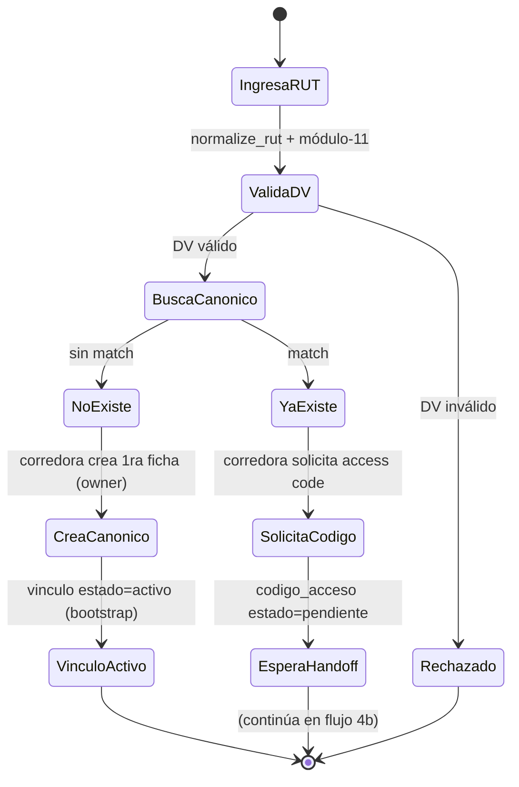
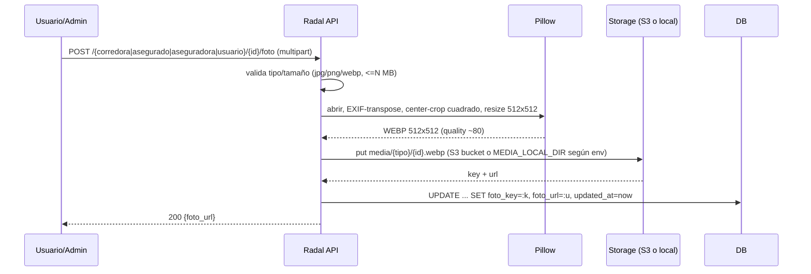

# Radal — Data Model v2 (re-arquitectura de identidad multi-perfil)

> Estado: **PROPUESTA de arquitecto para revisión humana.** Todo cambio aquí es
> **ADITIVO** sobre el modelo v1 (`data-model.md`). No se elimina ni se renombra
> ninguna tabla, columna, FK o enum existente. Las columnas nuevas son
> `NULLABLE` con defaults para que las filas/seed actuales sigan válidas.

---

## 1. Design overview

### 1.1 El problema

El modelo v1 es **single-perfil**: sólo existe el actor `corredora`. Todo se
scope-a por `corredora_id` con igualdad de columna (`scope_to_tenant`). El
`usuario.rol` es un enum plano que **confunde macro-perfil y sub-rol**. No hay
entidades canónicas cross-tenant: `aseguradora` es per-tenant (tiene
`corredora_id NOT NULL`), y el "asegurado" vive como `cliente` (relación
per-corredora, sin RUT único global).

El modelo v2 introduce **tres macro-perfiles** (corredora, aseguradora,
asegurado; + futuro liquidador) y una capa de **entidades canónicas
cross-tenant** identificadas por identificadores oficiales (RUT / código CMF),
enlazadas a las corredoras **muchos-a-muchos** vía **vínculos**. Una corredora
sólo ve las entidades canónicas con las que tiene un vínculo `activo`.

### 1.2 Estrategia: capa canónica NUEVA encima del embudo operacional INTACTO

```
        CAPA CANÓNICA (nueva, cross-tenant)                CAPA OPERACIONAL (v1, intacta)
        ───────────────────────────────────                ──────────────────────────────
   corredora* ── vinculo_asegurado ── asegurado                 cliente ─ activo ─ proceso_ramo
       │        └ vinculo_aseguradora ┘  │                         │        └ poliza ─ siniestro …
       │                aseguradora_entidad                         │
       │                                                            │
       └───────────── codigo_acceso (hash) ─────────────┘   cliente.asegurado_id ─► asegurado (NUEVO, nullable)
```

- **La capa operacional NO cambia.** `cliente → activo → proceso_ramo →
  cotizacion/oferta → poliza → siniestro`, y las 3 sub-tablas de `poliza`,
  siguen scope-adas por `corredora_id` exactamente como hoy. Ningún FK se
  repunta.
- **La capa canónica es nueva.** `asegurado` y `aseguradora_entidad` guardan la
  identidad + perfil UNA vez, con **UNIQUE global** sobre el RUT normalizado.
- **El puente es aditivo:** `cliente` gana una FK **opcional** `asegurado_id`
  hacia la entidad canónica. `cliente` sigue siendo el target FK de todo lo que
  está debajo, así que **nada bajo `cliente` cambia**.
- **`aseguradora` (v1) NO se toca.** Se promueve una tabla NUEVA
  `aseguradora_entidad` como canónica; la vieja `aseguradora` (per-tenant) sigue
  siendo el target de `poliza.aseguradora_id`, `oferta.aseguradora_id`,
  `coaseguro_participacion.aseguradora_id`, `renovacion.aseguradora_id`. Se le
  agrega una FK **opcional** `entidad_id` para relacionarla con la canónica.
- **`usuario` gana** `macro_perfil`, `subrol`, `foto_url` y FKs opcionales
  `asegurado_id` / `aseguradora_entidad_id`, dejando `rol` y `corredora_id`
  intactos.

### 1.3 KEY DECISIONS (requieren confirmación humana)

| # | Decisión | Alternativa descartada | Motivo |
|---|---|---|---|
| D1 | **`aseguradora` v1 se conserva como "vista per-tenant"; se crea `aseguradora_entidad` canónica NUEVA.** Los 4 FKs a `aseguradora` no se repuntan. | Repuntar los FKs a la canónica y borrar `corredora_id`. | Repuntar 4 FKs `NOT NULL` rompe routers y seed. Aditivo = cero riesgo. La consolidación de FKs es un refactor posterior. |
| D2 | **`cliente` = cara operacional del vínculo `activo`.** Gana `asegurado_id` nullable; NO se le impone UNIQUE sobre `rut`. | Fusionar `cliente` con `asegurado`. | Un mismo asegurado bajo 2 corredoras = 2 filas `cliente` (realidad de datos v1). UNIQUE en `cliente.rut` rompería eso. |
| D3 | **`asegurado_adicional` se deja tal cual** (tercero con interés asegurable). No se fusiona con `asegurado`. Opcional futuro: FK nullable a canónica. | Modelarlo como `asegurado`. | Es un concepto distinto (banco/leasing/acreedor prendario). Fuera de MVP. |
| D4 | **RBAC config-driven en un archivo Python** (`roles_config.py`), NO en tablas DB. | Tablas `rol` / `permiso` / `rol_permiso`. | El spec pide "trivially swappable, one-file data change". Sin joins en cada request. Migrable a DB después si hace falta. |
| D5 | **`macro_perfil` + `subrol` como columnas nuevas** junto a `rol` (no se elimina `rol`). Backfill desde `rol`. | Reemplazar `rol`. | Mantiene compilando `RolEnum` / `require_roles` / guards existentes. |
| D6 | **`codigo_acceso` guarda sólo `code_hash` (HMAC-SHA256 con pepper)**, no bcrypt. Single-use atómico, expiry corto, rate-limit, auditoría. | bcrypt del código. | El código ya es alta-entropía (160 bits); bcrypt trunca a 72 bytes y su lentitud no aporta. SHA-256/HMAC es correcto y rápido. |
| D7 | **Fotos de perfil = WEBP 512×512** para orgs (corredora/aseguradora/asegurado) y humanos (usuario). Se guarda `key` + `url`. Backend en S3 (`radal-dev-185011028331/media/`) o dir local según env. | Guardar el binario en DB / múltiples tamaños. | Pequeño, uniforme, servible por CDN. Pillow convierte+redimensiona en el upload. |
| D8 | **Identificador canónico = RUT normalizado** (`BODY-DV`, sin puntos, K mayúscula, sin ceros a la izquierda). El "código CMF" se guarda como metadata, NO como key pública (ver §2.2). | Key por "código de corredor". | El registro CMF es **RUT-keyed**; no existe un "código de corredor" público corto estable (investigación confirmada). |
| D9 | **Aislamiento tenant híbrido:** el embudo operacional sigue por columna `corredora_id`; el acceso a entidades canónicas se filtra por **vínculo activo** (gate nuevo, sólo en ese punto). No se retrofitea vínculo en las queries existentes. | Reescribir `scope_to_tenant` para vínculos. | Evita fugas y mantiene el código v1 sin tocar. |

### 1.4 ASSUMPTIONS (a validar)

- **A1 — Matriz RBAC en blanco:** el equipo entregó la matriz vacía. La de
  `roles_config.py` / `rbac-matrix.md` es **PROPUESTA — validar**.
- **A2 — `codigo_cmf` de Radal = "TBD"** (dato pendiente). Se guarda como string
  con status `unknown`; el hook de verificación CMF es manual/TBD (no hay API
  pública estable).
- **A3 — `fecha_doc_nombramiento` de Radal = null (TBD).**
- **A4 — Verificación CMF:** por ahora **manual** (`cmf_verification_method =
  manual`), registrando `cmf_verified_at` cuando un humano lo confirma contra el
  registro público (por RUT). Scraping HTML es posible pero frágil; no hay API
  confirmada.
- **A5 — Sub-rol nuevo `especialista_tecnico`** (macro corredora) y sub-roles
  `suscriptor` (aseguradora), `admin_liquidador`/`liquidador` (liquidador) NO
  existen en `RolEnum` v1. Se modelan sólo en `subrol` (string libre validado
  contra `roles_config.ROLES`), **sin** tocar `RolEnum`.
- **A6 — Expiry por defecto del código:** 72h (dentro del rango 24-72h del
  spec), configurable vía settings. Single-use (`max_usos = 1`).
- **A7 — Un `usuario` pertenece a exactamente UNA entidad** (su `corredora_id` o
  `asegurado_id` o `aseguradora_entidad_id`). Multi-entidad por usuario queda
  fuera de MVP.

---

## 2. Full schema v2

Leyenda: **[KEPT]** = tabla v1 sin cambios · **[KEPT+]** = tabla v1 con columnas
aditivas · **[NEW]** = tabla nueva. Enums `native_enum=False` (VARCHAR + validación
app), consistente con v1. Money en UF (`Numeric`).

### 2.1 Entidades canónicas cross-tenant

#### `corredora` **[KEPT+]** — org corredora (raíz tenant y ahora también entidad canónica)
Purpose: la corredora como persona jurídica registrada en CMF; raíz del tenant.

| Columna | Tipo | Null | Nota |
|---|---|---|---|
| id | int PK | no | (existente) |
| nombre | str | no | (existente) |
| rut | str | no | (existente) — se **normaliza** en escritura; se añade índice UNIQUE nuevo `uq_corredora_rut_norm` sobre columna generada/normalizada (ver migración) |
| logo_url | str | sí | (existente) — legacy; nuevo pipeline usa `foto_key`/`foto_url` |
| created_at | datetime | no | (existente) |
| **razon_social** | str | sí | NEW |
| **nombre_fantasia** | str | sí | NEW |
| **codigo_cmf** | str | sí | NEW — "TBD" para Radal |
| **cmf_tipo_registro** | str | sí | NEW — `CSNAT` \| `CSJUR` |
| **cmf_numero_inscripcion** | str | sí | NEW — manual |
| **cmf_estado** | enum | sí | NEW — `vigente`\|`no_vigente`\|`unknown` (default `unknown`) |
| **cmf_verified_at** | datetime | sí | NEW |
| **cmf_verification_method** | enum | sí | NEW — `manual`\|`scrape`\|`certificate` |
| **vigencia** | str | sí | NEW — texto libre, e.g. "Corredor con registro vigente" |
| **tipo_persona** | enum | sí | NEW — `juridica`\|`natural` |
| **tipo_doc_nombramiento** | str | sí | NEW |
| **fecha_doc_nombramiento** | date | sí | NEW (null TBD) |
| **telefono** | str | sí | NEW |
| **correo** | str | sí | NEW |
| **domicilio** | str | sí | NEW |
| **comuna** | str | sí | NEW |
| **region** | str | sí | NEW |
| **foto_key** | str | sí | NEW — key S3/local del webp 512 |
| **foto_url** | str | sí | NEW — URL servible |
| **perfil_extra** | JSON | sí | NEW — extensible (campos futuros sin migración) |
| **updated_at** | datetime | sí | NEW |

#### `aseguradora_entidad` **[NEW]** — aseguradora canónica cross-tenant
Purpose: la compañía aseguradora como entidad global identificada por RUT/CMF, compartida entre corredoras vía vínculo.

| Columna | Tipo | Null | Nota |
|---|---|---|---|
| id | int PK | no | |
| razon_social | str | no | |
| nombre_fantasia | str | sí | |
| rut | str | no | UNIQUE (`uq_aseguradora_entidad_rut`), normalizado |
| codigo_cmf | str | sí | |
| cmf_estado | enum | sí | `vigente`\|`no_vigente`\|`unknown` (default `unknown`) |
| cmf_verified_at | datetime | sí | |
| cmf_verification_method | enum | sí | `manual`\|`scrape`\|`certificate` |
| tipo_persona | enum | sí | `juridica`\|`natural` (default `juridica`) |
| contacto_nombre | str | sí | |
| telefono | str | sí | |
| correo | str | sí | |
| domicilio | str | sí | |
| sitio_pago_url | str | sí | |
| foto_key | str | sí | webp 512 |
| foto_url | str | sí | |
| perfil_extra | JSON | sí | extensible |
| created_at | datetime | no | |
| updated_at | datetime | sí | |

#### `asegurado` **[NEW]** — asegurado canónico cross-tenant (persona natural o jurídica)
Purpose: la identidad canónica del asegurado (por RUT/DNI), una sola vez, independiente de cualquier corredora. `cliente` la referencia.

| Columna | Tipo | Null | Nota |
|---|---|---|---|
| id | int PK | no | |
| tipo_persona | enum | no | `natural`\|`juridica` |
| rut | str | no | UNIQUE (`uq_asegurado_rut`), normalizado (RUT o DNI) |
| nombre | str | sí | persona natural |
| razon_social | str | sí | persona jurídica |
| nombre_fantasia | str | sí | |
| giro | str | sí | |
| contacto_nombre | str | sí | |
| telefono | str | sí | |
| correo | str | sí | |
| domicilio | str | sí | |
| comuna | str | sí | |
| region | str | sí | |
| foto_key | str | sí | webp 512 (logo o foto) |
| foto_url | str | sí | |
| perfil_extra | JSON | sí | extensible |
| created_by_corredora_id | int FK→corredora | sí | quién creó la primera ficha (owner inicial) |
| created_at | datetime | no | |
| updated_at | datetime | sí | |

### 2.2 Nota de identificadores (RUT / CMF)

- **RUT canónico:** almacenar forma normalizada `BODY-DV` (sin puntos, K
  mayúscula, sin ceros a la izquierda). Validar módulo-11 en el ingreso; rechazar
  DV inválido. Renderizar `12.345.678-5` sólo para display. UNIQUE global aplica
  **sólo** a las tablas canónicas (`asegurado`, `aseguradora_entidad`,
  `corredora`), NO a `cliente`/`aseguradora` v1.
- **Código CMF:** el registro público CMF es **RUT-keyed**; no hay un "código de
  corredor" público corto estable ni API oficial. Se guarda `codigo_cmf`
  (string, puede ser "TBD"), `cmf_tipo_registro`, `cmf_numero_inscripcion`
  (manual), `cmf_estado`, `cmf_verified_at`, `cmf_verification_method`. El "hook
  de verificación CMF" es **manual/TBD** por ahora.

Helpers de RUT (a implementar en `app/core/rut.py`): `normalize_rut`,
`compute_dv`, `is_valid_rut`, `format_rut` (algoritmo módulo-11, pesos 2..7).

### 2.3 Usuario y auth

#### `usuario` **[KEPT+]** — persona que inicia sesión
Purpose: usuario autenticable; ahora pertenece a UNA de las macro-entidades.

| Columna | Tipo | Null | Nota |
|---|---|---|---|
| id | int PK | no | (existente) |
| corredora_id | int FK→corredora | no* | (existente) — se mantiene `NOT NULL` para usuarios de corredora. Ver A7 / migración: para usuarios de otras macro-entidades queda un valor sentinela o se relaja en fase posterior. En MVP sólo hay usuarios de corredora. |
| nombre | str | no | (existente) |
| email | str UNIQUE | no | (existente) |
| hashed_password | str | no | (existente) |
| cargo | str | no | (existente) |
| rol | RolEnum | no | (existente) — **no se elimina** |
| activo | bool | no | (existente) |
| created_at | datetime | no | (existente) |
| **macro_perfil** | enum | sí | NEW — `corredora`\|`asegurado`\|`aseguradora`\|`liquidador`. Backfill desde `rol`. |
| **subrol** | str | sí | NEW — validado contra `roles_config.ROLES`. Backfill desde `rol`. |
| **asegurado_id** | int FK→asegurado | sí | NEW — si `macro_perfil=asegurado` |
| **aseguradora_entidad_id** | int FK→aseguradora_entidad | sí | NEW — si `macro_perfil=aseguradora` |
| **foto_key** | str | sí | NEW — webp 512 |
| **foto_url** | str | sí | NEW |
| **updated_at** | datetime | sí | NEW |

RBAC no vive en DB (D4). `subrol` es la clave que `require_permission` cruza
contra `roles_config`.

#### `aseguradora` **[KEPT+]** — catálogo per-tenant (v1, intacto)
Purpose: fila per-corredora de la aseguradora, target de los FKs operacionales v1. Sin cambios de semántica.

| Columna | Tipo | Null | Nota |
|---|---|---|---|
| id, corredora_id, nombre, rut, sitio_pago_url | — | — | (existentes, sin cambios) |
| **entidad_id** | int FK→aseguradora_entidad | sí | NEW — enlace opcional a la canónica |

### 2.4 Vínculos (M:N corredora ↔ entidad canónica)

#### `vinculo_asegurado` **[NEW]** — enlace M:N corredora ↔ asegurado
Purpose: da a una corredora acceso a un asegurado canónico, con estado y scope; el aislamiento tenant sobre la capa canónica se hace por aquí.

| Columna | Tipo | Null | Nota |
|---|---|---|---|
| id | int PK | no | |
| corredora_id | int FK→corredora | no | |
| asegurado_id | int FK→asegurado | no | |
| estado | enum | no | `pendiente`\|`activo`\|`revocado` (default `pendiente`) |
| scope_ramo_id | int FK→ramo | sí | scope por ramo (nullable = todos) |
| scope_tramo | str | sí | scope por tramo/segmento (texto) |
| codigo_acceso_id | int FK→codigo_acceso | sí | código que originó el vínculo (si aplica) |
| created_by | int FK→usuario | sí | quién lo creó |
| created_at | datetime | no | |
| activated_at | datetime | sí | |
| revoked_at | datetime | sí | |
| — | — | — | UNIQUE (`corredora_id`, `asegurado_id`) parcial por estado activo |

#### `vinculo_aseguradora` **[NEW]** — enlace M:N corredora ↔ aseguradora_entidad
Purpose: idéntico patrón para aseguradoras canónicas.

| Columna | Tipo | Null | Nota |
|---|---|---|---|
| id | int PK | no | |
| corredora_id | int FK→corredora | no | |
| aseguradora_entidad_id | int FK→aseguradora_entidad | no | |
| estado | enum | no | `pendiente`\|`activo`\|`revocado` |
| scope_ramo_id | int FK→ramo | sí | |
| scope_tramo | str | sí | |
| codigo_acceso_id | int FK→codigo_acceso | sí | |
| created_by | int FK→usuario | sí | |
| created_at | datetime | no | |
| activated_at | datetime | sí | |
| revoked_at | datetime | sí | |
| — | — | — | UNIQUE (`corredora_id`, `aseguradora_entidad_id`) activo |

### 2.5 Cliente (puente operacional → canónico)

#### `cliente` **[KEPT+]**
Purpose: relación per-corredora con el asegurado (NIVEL-1 del expediente); ahora puede apuntar a la ficha canónica.

Todas las columnas v1 se mantienen. Se añade:

| Columna | Tipo | Null | Nota |
|---|---|---|---|
| **asegurado_id** | int FK→asegurado | sí | NEW — enlace opcional a la canónica. `cliente.rut` NO gana UNIQUE. |

### 2.6 Access codes

#### `codigo_acceso` **[NEW]** — código de acceso hash-eado, expirable, single-use, auditado
Purpose: gate seguro para vincular una entidad canónica ya registrada a una corredora nueva; el titular entrega el código a la corredora que lo redime.

| Columna | Tipo | Null | Nota |
|---|---|---|---|
| id | int PK | no | |
| entidad_tipo | enum | no | `asegurado`\|`aseguradora` |
| entidad_id | int | no | id canónico (app-enforced por `entidad_tipo`) |
| corredora_solicitante_id | int FK→corredora | no | quién solicita el vínculo |
| code_hash | bytes/str | no | UNIQUE, index — HMAC-SHA256(pepper, code). **Nunca** el plaintext |
| purpose | str | no | `vinculo` (default) — permite otros usos futuros |
| estado | enum | no | `pendiente`\|`redimido`\|`expirado`\|`revocado` (default `pendiente`) |
| max_usos | int | no | default 1 (single-use) |
| usos | int | no | default 0 |
| intentos | int | no | default 0 (rate-limit) |
| max_intentos | int | no | default 5 |
| scope_ramo_id | int FK→ramo | sí | scope heredado al vínculo |
| scope_tramo | str | sí | |
| expires_at | datetime | no | expiry corto (default +72h, configurable) |
| created_by | int FK→usuario | sí | emisor (usuario de la entidad titular) |
| redeemed_by | int FK→usuario | sí | quién lo redimió (usuario de la corredora solicitante) |
| redeemed_at | datetime | sí | |
| revoked_at | datetime | sí | |
| created_at | datetime | no | |

Reglas: válido sii `estado=pendiente AND revoked_at IS NULL AND now < expires_at
AND usos < max_usos AND intentos < max_intentos`. Redención = UPDATE atómico
condicional (`... WHERE code_hash=:h AND estado='pendiente' ... RETURNING`) para
evitar doble-gasto. `hmac.compare_digest` para comparar. Auditar create / send /
attempt / redeem / revoke (sin plaintext en logs).

#### `codigo_acceso_evento` **[NEW, opcional]** — auditoría de códigos
Purpose: bitácora inmutable de eventos del código (emisión, envío, intento, redención, revocación).

| Columna | Tipo | Null | Nota |
|---|---|---|---|
| id | int PK | no | |
| codigo_acceso_id | int FK→codigo_acceso | no | |
| evento | enum | no | `created`\|`sent`\|`attempt_ok`\|`attempt_fail`\|`redeemed`\|`revoked`\|`expired` |
| usuario_id | int FK→usuario | sí | |
| ip | str | sí | |
| user_agent | str | sí | |
| created_at | datetime | no | |

### 2.7 Media / profile pictures

No hay tabla separada: `foto_key` + `foto_url` viven inline en `corredora`,
`aseguradora_entidad`, `asegurado`, `usuario`. Pipeline de upload (§4c) convierte
a **WEBP 512×512** (Pillow) y guarda en S3 (`radal-dev-185011028331/media/…`) o
dir local según `MEDIA_BACKEND` env. Nuevos settings:

```
MEDIA_BACKEND=local|s3          # default local
MEDIA_LOCAL_DIR=./media
MEDIA_S3_BUCKET=radal-dev-185011028331
MEDIA_S3_PREFIX=media/
ACCESS_CODE_TTL_HOURS=72
ACCESS_CODE_PEPPER=<secret>     # HMAC pepper para code_hash
```

### 2.8 Tablas KEPT sin cambios (embudo operacional v1)

`ramo`, `activo`, `asegurado_adicional`, `proceso_ramo`, `poliza`,
`coaseguro_participacion`, `ubicacion_poliza`, `cobertura_item`, `renovacion`,
`cotizacion`, `oferta`, `siniestro`, `solicitud_inspeccion`, `inspeccion`,
`documento`, `observacion`, `actividad` — **sin cambios**. Sus enums, FKs y
scope por `corredora_id` se mantienen.

---

## 3. Mermaid erDiagram (modelo completo)

```mermaid
erDiagram
    corredora ||--o{ usuario : "emplea"
    corredora ||--o{ ramo : "define"
    corredora ||--o{ cliente : "gestiona"
    corredora ||--o{ aseguradora : "cataloga (v1)"
    corredora ||--o{ vinculo_asegurado : "solicita/posee"
    corredora ||--o{ vinculo_aseguradora : "solicita/posee"
    corredora ||--o{ codigo_acceso : "solicita"
    corredora ||--o{ asegurado : "creo_primera_ficha"

    asegurado ||--o{ vinculo_asegurado : "vinculado_a"
    asegurado ||--o{ cliente : "canonico_de"
    asegurado ||--o{ usuario : "tiene_usuarios"

    aseguradora_entidad ||--o{ vinculo_aseguradora : "vinculado_a"
    aseguradora_entidad ||--o{ aseguradora : "canonico_de"
    aseguradora_entidad ||--o{ usuario : "tiene_usuarios"

    codigo_acceso ||--o{ codigo_acceso_evento : "audita"
    codigo_acceso ||--o| vinculo_asegurado : "origina"
    codigo_acceso ||--o| vinculo_aseguradora : "origina"

    ramo ||--o{ vinculo_asegurado : "scope"
    ramo ||--o{ vinculo_aseguradora : "scope"
    ramo ||--o{ codigo_acceso : "scope"

    usuario ||--o{ codigo_acceso : "emite/redime"

    cliente ||--o{ activo : "posee"
    cliente ||--o{ poliza : "titular"
    cliente ||--o{ asegurado_adicional : "tiene"
    cliente ||--o{ cotizacion : "solicita"
    cliente ||--o{ renovacion : "renueva"
    cliente ||--o{ siniestro : "reporta"

    activo ||--o{ proceso_ramo : "procesa"
    activo ||--o{ poliza : "asegura"
    ramo  ||--o{ proceso_ramo : "tipo"
    proceso_ramo ||--o{ poliza : "resulta"
    proceso_ramo ||--o{ oferta : "recibe"
    proceso_ramo ||--o{ solicitud_inspeccion : "requiere"

    aseguradora ||--o{ poliza : "emite"
    aseguradora ||--o{ oferta : "cotiza"
    aseguradora ||--o{ renovacion : "renueva"
    aseguradora ||--o{ coaseguro_participacion : "coasegura"

    poliza ||--o{ coaseguro_participacion : "reparte"
    poliza ||--o{ ubicacion_poliza : "ubica"
    poliza ||--o{ cobertura_item : "cubre"
    poliza ||--o{ siniestro : "sufre"

    cotizacion ||--o{ oferta : "genera"
    activo ||--o{ solicitud_inspeccion : "inspecciona"
    solicitud_inspeccion ||--o| inspeccion : "produce"
    activo ||--o{ inspeccion : "evalua"

    usuario ||--o{ documento : "autor"
    usuario ||--o{ observacion : "autor"
    usuario ||--o{ actividad : "actor"

    corredora {
        int id PK
        string rut UK "canonico normalizado"
        string codigo_cmf "TBD"
        string razon_social
        string nombre_fantasia
        string tipo_persona
        string foto_key
        json perfil_extra
    }
    asegurado {
        int id PK
        string rut UK "RUT/DNI normalizado"
        string tipo_persona
        string nombre
        string razon_social
        int created_by_corredora_id FK
        string foto_key
        json perfil_extra
    }
    aseguradora_entidad {
        int id PK
        string rut UK
        string codigo_cmf
        string razon_social
        string foto_key
        json perfil_extra
    }
    usuario {
        int id PK
        int corredora_id FK
        int asegurado_id FK
        int aseguradora_entidad_id FK
        string rol "v1 kept"
        string macro_perfil "NEW"
        string subrol "NEW"
        string foto_key
    }
    aseguradora {
        int id PK
        int corredora_id FK
        int entidad_id FK "NEW canonico"
        string nombre
    }
    vinculo_asegurado {
        int id PK
        int corredora_id FK
        int asegurado_id FK
        string estado "pendiente|activo|revocado"
        int scope_ramo_id FK
        int codigo_acceso_id FK
    }
    vinculo_aseguradora {
        int id PK
        int corredora_id FK
        int aseguradora_entidad_id FK
        string estado
        int scope_ramo_id FK
        int codigo_acceso_id FK
    }
    codigo_acceso {
        int id PK
        string entidad_tipo "asegurado|aseguradora"
        int entidad_id
        int corredora_solicitante_id FK
        string code_hash UK
        string estado "pendiente|redimido|expirado|revocado"
        datetime expires_at
        int max_usos
        int usos
    }
    codigo_acceso_evento {
        int id PK
        int codigo_acceso_id FK
        string evento
        int usuario_id FK
        string ip
    }
    cliente {
        int id PK
        int corredora_id FK
        int asegurado_id FK "NEW canonico"
        string rut "no UK"
        string estado
    }
    ramo { int id PK
        int corredora_id FK
        string nombre }
    activo { int id PK
        int corredora_id FK
        int cliente_id FK }
    asegurado_adicional { int id PK
        int cliente_id FK
        string rut }
    proceso_ramo { int id PK
        int activo_id FK
        int ramo_id FK }
    poliza { int id PK
        int cliente_id FK
        int aseguradora_id FK
        int ramo_id FK }
    coaseguro_participacion { int id PK
        int poliza_id FK
        int aseguradora_id FK }
    ubicacion_poliza { int id PK
        int poliza_id FK }
    cobertura_item { int id PK
        int poliza_id FK }
    cotizacion { int id PK
        int cliente_id FK
        int ramo_id FK }
    oferta { int id PK
        int cotizacion_id FK
        int aseguradora_id FK }
    renovacion { int id PK
        int poliza_id FK
        int aseguradora_id FK }
    siniestro { int id PK
        int poliza_id FK
        int cliente_id FK }
    solicitud_inspeccion { int id PK
        int activo_id FK }
    inspeccion { int id PK
        int activo_id FK
        int inspector_id FK }
    documento { int id PK
        int corredora_id FK
        int autor_id FK }
    observacion { int id PK
        int corredora_id FK
        int autor_id FK }
    actividad { int id PK
        int corredora_id FK
        int usuario_id FK }
```



**Conteo de entidades en el erDiagram: 28** (11 nuevas/modificadas destacadas +
17 operacionales KEPT). Nuevas: `asegurado`, `aseguradora_entidad`,
`vinculo_asegurado`, `vinculo_aseguradora`, `codigo_acceso`,
`codigo_acceso_evento`. Modificadas (KEPT+): `corredora`, `usuario`,
`aseguradora`, `cliente`. KEPT (18, contando las 3 sub-tablas de poliza y las 2
de inspección): `ramo`, `activo`, `asegurado_adicional`, `proceso_ramo`,
`poliza`, `coaseguro_participacion`, `ubicacion_poliza`, `cobertura_item`,
`cotizacion`, `oferta`, `renovacion`, `siniestro`, `solicitud_inspeccion`,
`inspeccion`, `documento`, `observacion`, `actividad`.

---

## 4. Flows

### 4a. Validación de identidad + decisión crear-vs-solicitar-código

Cuando una corredora quiere trabajar con un asegurado (por RUT) o una
aseguradora (por RUT/CMF):

1. Validar formato + DV módulo-11 del RUT (rechazar si inválido).
2. Normalizar (`BODY-DV`).
3. Buscar en la tabla canónica (`asegurado` / `aseguradora_entidad`) por RUT
   normalizado.
   - **No existe** → la corredora crea la PRIMERA ficha canónica (owner inicial)
     y un `vinculo_*` en estado `activo` directamente (bootstrap / primer uso).
   - **Existe** → la entidad ya usó Radal con otra corredora. La corredora NO
     puede auto-agregarla: debe **solicitar un código de acceso**; el titular lo
     entrega; al redimirse se crea el vínculo.



### 4b. Access code: emisión → hand-off → redención → vínculo

```mermaid
sequenceDiagram
    participant CB as Corredora B (solicitante)
    participant API as Radal API
    participant OWN as Titular (asegurado/aseguradora)
    participant DB as DB

    CB->>API: POST /codigos-acceso/solicitar {entidad_tipo, rut, scope}
    API->>DB: crea codigo_acceso(estado=pendiente, corredora_solicitante=B)
    Note over API,DB: guarda code_hash = HMAC(pepper, code); plaintext se muestra 1 sola vez
    API-->>OWN: (out-of-band) el TITULAR genera/aprueba y recibe el code plaintext
    OWN-->>CB: hand-off del código (fuera de banda: correo/tel)
    CB->>API: POST /codigos-acceso/redimir {code}
    API->>DB: UPDATE codigo_acceso SET usos=usos+1,estado='redimido'\n WHERE code_hash=:h AND estado='pendiente'\n AND now<expires_at AND usos<max_usos RETURNING
    alt válido
        DB-->>API: fila
        API->>DB: crea vinculo_* (estado=activo, scope heredado, codigo_acceso_id)
        API->>DB: log codigo_acceso_evento(redeemed)
        API-->>CB: 200 vínculo creado
    else inválido/expirado/agotado
        DB-->>API: 0 filas
        API->>DB: intentos+1 ; log attempt_fail ; rate-limit por IP
        API-->>CB: 400 código inválido
    end
```

Notas de seguridad (D6): código base32 ≥128 bits (`secrets.token_bytes(20)`),
sólo hash en DB, expiry corto (72h), single-use atómico, `max_intentos`,
`hmac.compare_digest`, purga periódica de expirados, TLS, sin plaintext en logs.

### 4c. Upload de foto de perfil (convertir a WEBP 512)



---

## 5. Migración / mapping desde v1 + seed

### 5.1 Migración (todo aditivo)

1. **`corredora`:** `ADD COLUMN` de todos los campos de perfil CMF/dirección +
   `foto_key`/`foto_url`/`perfil_extra`/`updated_at` (todos NULLABLE). Backfill
   `razon_social := nombre` donde esté vacío. Índice UNIQUE nuevo sobre RUT
   normalizado (aplicar sólo tras normalizar filas existentes; en dev con seed
   Radal es trivial).
2. **`usuario`:** `ADD COLUMN macro_perfil, subrol, asegurado_id,
   aseguradora_entidad_id, foto_key, foto_url, updated_at` (NULLABLE). **Backfill
   `macro_perfil`/`subrol` desde `rol`:** `admin_corredora → (corredora,
   admin_corredora)`, `ejecutivo_corredora → (corredora, ejecutivo_corredora)`,
   `inspector → (corredora, inspector)`, etc. `rol` se mantiene.
3. **`aseguradora`:** `ADD COLUMN entidad_id` (NULLABLE). Sin repuntar FKs.
4. **`cliente`:** `ADD COLUMN asegurado_id` (NULLABLE). Sin UNIQUE en `rut`.
5. **Tablas NUEVAS:** `asegurado`, `aseguradora_entidad`, `vinculo_asegurado`,
   `vinculo_aseguradora`, `codigo_acceso`, `codigo_acceso_evento` — `CREATE`.
6. **`__init__.py` de models** y `db.base`: registrar los modelos nuevos
   (aditivo). `deps.py`: agregar `require_permission` y exponer
   `macro_perfil`/`subrol`; **conservar** `require_roles`,
   `require_admin_corredora`, `require_corredora_staff`,
   `get_current_corredora_id`, `scope_to_tenant`.

Mapping conceptual v1→v2:

| v1 | v2 |
|---|---|
| `cliente` (asegurado-como-cliente) | sigue = relación per-corredora; gana `asegurado_id` → `asegurado` canónico |
| `asegurado_adicional` | sin cambios (tercero con interés) |
| `aseguradora` (per-tenant) | sigue = vista per-tenant; gana `entidad_id` → `aseguradora_entidad` canónica |
| `usuario.rol` | se conserva; se deriva `macro_perfil`+`subrol` |
| (no existía) | `asegurado`, `aseguradora_entidad`, `vinculo_*`, `codigo_acceso*` |

### 5.2 Nuevo SEED (SÓLO Radal, sin datos falsos)

El seed v2 crea **únicamente**:

- **1 `corredora` = Radal Seguros:** `razon_social="Radal Seguros SpA"`,
  `nombre_fantasia="Radal"`, `nombre="Radal"`, `rut="78.418.927-9"` (guardado
  normalizado `78418927-9`), `codigo_cmf="TBD"` (`cmf_estado=unknown`),
  `vigencia="Corredor con registro vigente"`, `tipo_persona="juridica"`
  (`Persona Jurídica`), `tipo_doc_nombramiento="Certificado"`,
  `fecha_doc_nombramiento=null` (TBD), `telefono="+56 9 9979 2277"`,
  `correo="jtdiaz@radalseguros.cl"`, `domicilio="Antonio Bellet 193, Oficina
  1210"`, `comuna="Providencia"`, `region="13"`.
- **4 `usuario` (password `radal1234`)** con `macro_perfil=corredora`:
  - `admin@radalseguros.cl` → `subrol=admin_corredora`
  - `ben@nirvana-ai.com` → `subrol=admin_corredora`
  - `jose@radalseguros.cl` → `subrol=ejecutivo_corredora`
  - `carla@radalseguros.cl` → `subrol=inspector`
  - `rol` (v1) se setea al valor equivalente para compatibilidad (`inspector`
    existe en `RolEnum`; `especialista_tecnico` NO se usa en el seed).
- **NADA de** clientes/activos/pólizas/cotizaciones/siniestros/ofertas falsos.
  Las tablas operacionales quedan **vacías**, listas para datos reales.
- **NO** se seedean asegurados/aseguradoras canónicas ni vínculos (se
  aprovisionan luego vía el flujo de linking).
- RBAC no se seedea en DB: vive en `roles_config.py`.

---

## 6. Archivos consumidores (para quien implemente)

- `backend/app/core/rut.py` **[NEW]** — helpers RUT (módulo-11).
- `backend/app/core/roles_config.py` **[NEW]** — matriz RBAC (ya creada).
- `backend/app/core/media.py` **[NEW]** — convert/resize webp 512 + storage local/S3.
- `backend/app/core/access_codes.py` **[NEW]** — generate/hash/verify/consume.
- `backend/app/api/deps.py` **[KEPT+]** — `require_permission(module, action)`; exponer `macro_perfil`/`subrol`; guards v1 intactos.
- `backend/app/models/{corredora,usuario,aseguradora,cliente}.py` **[KEPT+]** — columnas aditivas.
- `backend/app/models/{asegurado,aseguradora_entidad,vinculo,codigo_acceso}.py` **[NEW]**.
- `backend/app/models/__init__.py` **[KEPT+]** — registrar modelos nuevos.
- `backend/app/core/config.py` **[KEPT+]** — settings de media + access code.
- Seed script — reemplazar datos falsos por perfil Radal + 4 usuarios.
- Frontend: vista admin **Settings** (perfil corredora + usuarios + foto).
