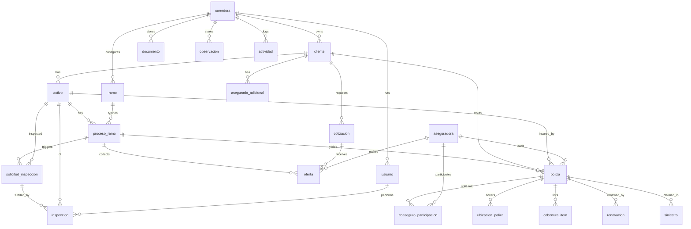

# Radal — Data Model (authoritative)

This is the **canonical logical + physical model**. The backend SQLAlchemy models must match table and
column names **EXACTLY** (lowercase `snake_case`, Spanish domain nouns). Money is UF numeric.
Percentages are 0–100. Every domain table carries `corredora_id` (tenant scope). Timestamps
(`created_at` / `updated_at`) are UTC.

## Conventions

- **PK**: every table has `id` (integer autoincrement unless noted).
- **FK**: `<entity>_id` references `<entity>.id`.
- **Tenant**: every domain table has `corredora_id → corredora.id` (except `corredora` itself).
- **Types**: `str` = TEXT/VARCHAR, `int` = INTEGER, `numeric` = NUMERIC (UF / percentages),
  `bool` = BOOLEAN, `datetime` = TIMESTAMP (UTC), `date` = DATE, `json` = JSON (TEXT-backed in SQLite),
  `enum` = TEXT constrained to listed values (enforced app-side + optional CHECK).
- **Nullable** columns are marked `(nullable)`.

## ER overview

`documento`, `observacion`, `actividad` attach polymorphically to any entity via
`(entidad_tipo, entidad_id)` — not drawn as FK edges above.

---

## Tables

### corredora — tenant / broker org
| column | type | notes |
|---|---|---|
| id | int PK | |
| nombre | str | broker name |
| rut | str | Chilean RUT |
| logo_url | str (nullable) | |
| created_at | datetime | |

_Purpose: the multi-tenant root. Everything is scoped to a corredora._

### usuario — a person who logs in
| column | type | notes |
|---|---|---|
| id | int PK | |
| corredora_id | int FK → corredora.id | |
| nombre | str | |
| email | str **unique** | login id |
| hashed_password | str | bcrypt |
| cargo | str | job title (e.g. "Ejecutivo Comercial") |
| rol | enum | `admin_corredora, ejecutivo_corredora, inspector, admin_asegurado, ejecutivo_asegurado, admin_aseguradora, ejecutivo_aseguradora` |
| activo | bool | |
| created_at | datetime | |

_Purpose: authentication + role-based access. Corredora roles only, this pass._

### aseguradora — insurer catalog
| column | type | notes |
|---|---|---|
| id | int PK | |
| nombre | str | e.g. Chubb Generales, HDI, Mapfre, Liberty |
| rut | str (nullable) | |
| sitio_pago_url | str (nullable) | insurer payment site |

_Purpose: catalog of insurers referenced by pólizas, coaseguro, ofertas, renovaciones._
_Note: shared catalog; carries corredora_id for tenant-scoped catalogs._

### ramo — configurable insurance line (per corredora)
| column | type | notes |
|---|---|---|
| id | int PK | |
| corredora_id | int FK → corredora.id | |
| nombre | str | e.g. "Incendio/Sismo" |
| requiere_inspeccion | bool | drives inspection stage |
| campos_min | json | minimum fields to open a process |
| reglas_presuscripcion | json | pre-underwriting rules |
| campos_comparador | json | fields driving the offer comparator |

_Purpose: config that makes processes "dynamic by ramo". Forms/rules derive from this._

### cliente — NIVEL-1 expediente (the asegurado as a client)
| column | type | notes |
|---|---|---|
| id | int PK | |
| corredora_id | int FK → corredora.id | |
| nombre | str | |
| rut | str | |
| sector | str (nullable) | e.g. Agroindustria |
| estado | enum | `activo, onboarding, prospecto, suspendido, archivado` |
| contacto_principal | str (nullable) | |
| telefono | str (nullable) | |
| email | str (nullable) | |
| ejecutivo_id | int FK → usuario.id (nullable) | assigned ejecutivo |
| fecha_alta | date (nullable) | |
| created_at | datetime | |

_Purpose: the client relationship; top of the expediente tree._

### activo — NIVEL-2 insurable good
| column | type | notes |
|---|---|---|
| id | int PK | |
| corredora_id | int FK → corredora.id | |
| cliente_id | int FK → cliente.id | |
| tipo_activo | str | e.g. planta, edificio, flota |
| nombre | str | |
| direccion | str (nullable) | |
| atributos | json | flexible per-ramo attributes |
| estado | enum | `activo, en_evaluacion, desactivado, archivado` |

_Purpose: a concrete insurable good; parent of proceso_ramo folders._

### asegurado_adicional — third party with insurable interest
| column | type | notes |
|---|---|---|
| id | int PK | |
| corredora_id | int FK → corredora.id | |
| cliente_id | int FK → cliente.id | |
| poliza_id | int FK → poliza.id (nullable) | |
| rut | str | |
| entidad | str | e.g. banco / leasing |
| tipo_seguro | str (nullable) | |
| relacion_bien | str (nullable) | relationship to the good |

_Purpose: banks/leasing/etc. with an interest in the insured good._

### proceso_ramo — operational folder of an activo for one ramo
| column | type | notes |
|---|---|---|
| id | int PK | |
| corredora_id | int FK → corredora.id | |
| activo_id | int FK → activo.id | |
| ramo_id | int FK → ramo.id | |
| periodo | str (nullable) | e.g. "2024" |
| vigencia_objetivo | date (nullable) | target coverage start |
| estado | enum | `creado, en_inspeccion, en_presuscripcion, en_cotizacion, en_negociacion, asegurado, en_siniestro, cerrado` |

_Purpose: tracks an activo through one ramo's lifecycle; convergence point._

### poliza — issued policy
| column | type | notes |
|---|---|---|
| id | int PK | |
| corredora_id | int FK → corredora.id | |
| cliente_id | int FK → cliente.id | |
| activo_id | int FK → activo.id (nullable) | |
| proceso_ramo_id | int FK → proceso_ramo.id (nullable) | |
| numero_poliza | str | unique-ish per tenant (e.g. POL-2024-0072) |
| ramo_id | int FK → ramo.id | |
| aseguradora_id | int FK → aseguradora.id | líder insurer |
| tiene_coaseguro | bool | |
| prima | numeric | UF |
| comision_pct | numeric | 0–100 |
| suma_asegurada | numeric | UF |
| tipo_cobertura | enum | `infravalorada, optima, sobrevalorada` |
| cobertura_pct | numeric | 0–100+ (coverage ratio) |
| vigencia_inicio | date | |
| vigencia_fin | date | |
| estado | enum | `vigente, no_vigente` |
| deducible_texto | str (nullable) | e.g. "2% mín UF 30" |
| limite_indemnizacion | numeric (nullable) | UF |
| plan_pago_cuotas | int (nullable) | number of installments |
| plan_pago_metodo | str (nullable) | e.g. Transferencia |
| pago_url | str (nullable) | |

_Purpose: the core policy record and coverage analyzer source._

### coaseguro_participacion — co-insurance split
| column | type | notes |
|---|---|---|
| id | int PK | |
| poliza_id | int FK → poliza.id | |
| aseguradora_id | int FK → aseguradora.id | |
| es_lider | bool | |
| porcentaje | numeric | 0–100, sums to 100 per póliza |

_Purpose: which insurers share a co-insured póliza and by how much._

### ubicacion_poliza — insured location line
| column | type | notes |
|---|---|---|
| id | int PK | |
| poliza_id | int FK → poliza.id | |
| nombre | str | e.g. "Planta Talca - Maquinaria" |
| direccion | str (nullable) | |
| suma_asegurada | numeric | UF |
| porcentaje | numeric | 0–100 of total |

_Purpose: per-location breakdown of the insured sum._

### cobertura_item — coverage or exclusion line
| column | type | notes |
|---|---|---|
| id | int PK | |
| poliza_id | int FK → poliza.id | |
| tipo | enum | `cobertura, exclusion` |
| descripcion | str | |

_Purpose: the covered/excluded lines shown on a póliza detail._

### renovacion — renewal in progress
| column | type | notes |
|---|---|---|
| id | int PK | |
| corredora_id | int FK → corredora.id | |
| poliza_id | int FK → poliza.id | |
| cliente_id | int FK → cliente.id | |
| ramo_id | int FK → ramo.id | |
| aseguradora_id | int FK → aseguradora.id | |
| aplica_coaseguro | bool | |
| prima_defender | numeric | UF at stake |
| comision_pct | numeric | 0–100 |
| fecha_vencimiento | date | drives días-restantes color |
| ejecutivo_id | int FK → usuario.id (nullable) | |
| estado | enum | `por_iniciar, cotizando, negociando` |
| estado_negociacion_texto | str (nullable) | free-text negotiation note |

_Purpose: the renewal pipeline record._

### cotizacion — quote request
| column | type | notes |
|---|---|---|
| id | int PK | |
| corredora_id | int FK → corredora.id | |
| cliente_id | int FK → cliente.id | |
| activo_id | int FK → activo.id (nullable) | |
| ramo_id | int FK → ramo.id | |
| bien_asegurar | str | what is being insured |
| valor_declarado | numeric | UF |
| fecha_envio | date (nullable) | |
| fecha_vence | date (nullable) | drives días-restantes color |
| prioridad | enum | `baja, media, alta` |
| estado | enum | `pendiente, respondida` |

_Purpose: an outgoing quote request awaiting insurer offers._

### oferta — an insurer's offer
| column | type | notes |
|---|---|---|
| id | int PK | |
| corredora_id | int FK → corredora.id | |
| cotizacion_id | int FK → cotizacion.id (nullable) | |
| proceso_ramo_id | int FK → proceso_ramo.id (nullable) | |
| aseguradora_id | int FK → aseguradora.id | |
| prima | numeric | UF |
| deducible | str (nullable) | |
| coberturas | json | offered coverages |
| exclusiones | json | offered exclusions |
| vigencia | str (nullable) | offered term |
| estado | enum | `borrador, enviada, ajustada, aceptada, rechazada` |

_Purpose: comparable offers per cotización / proceso_ramo. "borrador" = subir, "enviada" = enviar._

### siniestro — claim
| column | type | notes |
|---|---|---|
| id | int PK | |
| corredora_id | int FK → corredora.id | |
| poliza_id | int FK → poliza.id | |
| cliente_id | int FK → cliente.id | |
| activo_id | int FK → activo.id (nullable) | |
| fecha_evento | date | |
| tipo | str | claim type |
| descripcion | str (nullable) | |
| estado | enum | `reportado, en_documentacion, en_evaluacion, pre_liquidado, liquidado, cerrado` |
| monto_estimado | numeric (nullable) | UF |
| monto_liquidado | numeric (nullable) | UF |
| fecha_liquidacion | date (nullable) | |

_Purpose: the claims record across its lifecycle._

### solicitud_inspeccion — inspection request
| column | type | notes |
|---|---|---|
| id | int PK | |
| corredora_id | int FK → corredora.id | |
| activo_id | int FK → activo.id | |
| proceso_ramo_id | int FK → proceso_ramo.id (nullable) | |
| motivo | str | |
| urgencia | str | e.g. baja/media/alta |
| fecha_objetivo | date (nullable) | |
| estado | enum | `solicitada, asignada` |
| created_by | int FK → usuario.id | requester |

_Purpose: request to inspect an activo, feeding an inspección._

### inspeccion — inspection instance
| column | type | notes |
|---|---|---|
| id | int PK | |
| corredora_id | int FK → corredora.id | |
| activo_id | int FK → activo.id | |
| solicitud_id | int FK → solicitud_inspeccion.id (nullable) | |
| inspector_id | int FK → usuario.id | |
| version | int | supports future version history |
| estado | enum | `solicitada, asignada, en_progreso, enviada, observada, validada, cerrada` |
| checklist | json | ramo-driven checklist (e.g. Incendio) |

_Purpose: the inspection with its checklist and review lifecycle._

### documento — shared file (polymorphic)
| column | type | notes |
|---|---|---|
| id | int PK | |
| corredora_id | int FK → corredora.id | |
| entidad_tipo | str | e.g. "poliza", "siniestro", "cliente" |
| entidad_id | int | id within entidad_tipo |
| nombre | str | |
| tipo | str | doc type |
| url | str | |
| version | int | |
| autor_id | int FK → usuario.id | |
| compartido_con | json | list of roles (the "enviar" gate) |
| created_at | datetime | |

_Purpose: files attachable to any entity; sharing driven by `compartido_con`._

### observacion — comment (polymorphic)
| column | type | notes |
|---|---|---|
| id | int PK | |
| corredora_id | int FK → corredora.id | |
| entidad_tipo | str | |
| entidad_id | int | |
| autor_id | int FK → usuario.id | |
| texto | str | |
| created_at | datetime | |

_Purpose: per-entity comments; groundwork for multi-actor collaboration._

### actividad — activity / audit log
| column | type | notes |
|---|---|---|
| id | int PK | |
| corredora_id | int FK → corredora.id | |
| usuario_id | int FK → usuario.id (nullable) | actor |
| accion | str | e.g. "Cliente creado", "Oferta recibida" |
| entidad_tipo | str | |
| entidad_id | int | |
| descripcion | str (nullable) | |
| created_at | datetime | |

_Purpose: the recent-activity feed and audit trail; role-colored dots in UI._

---

## Enum reference (quick)

- `usuario.rol`: admin_corredora, ejecutivo_corredora, inspector, admin_asegurado, ejecutivo_asegurado, admin_aseguradora, ejecutivo_aseguradora
- `cliente.estado`: activo, onboarding, prospecto, suspendido, archivado
- `activo.estado`: activo, en_evaluacion, desactivado, archivado
- `proceso_ramo.estado`: creado, en_inspeccion, en_presuscripcion, en_cotizacion, en_negociacion, asegurado, en_siniestro, cerrado
- `poliza.tipo_cobertura`: infravalorada, optima, sobrevalorada
- `poliza.estado`: vigente, no_vigente
- `cobertura_item.tipo`: cobertura, exclusion
- `renovacion.estado`: por_iniciar, cotizando, negociando
- `cotizacion.prioridad`: baja, media, alta
- `cotizacion.estado`: pendiente, respondida
- `oferta.estado`: borrador, enviada, ajustada, aceptada, rechazada
- `siniestro.estado`: reportado, en_documentacion, en_evaluacion, pre_liquidado, liquidado, cerrado
- `solicitud_inspeccion.estado`: solicitada, asignada
- `inspeccion.estado`: solicitada, asignada, en_progreso, enviada, observada, validada, cerrada
