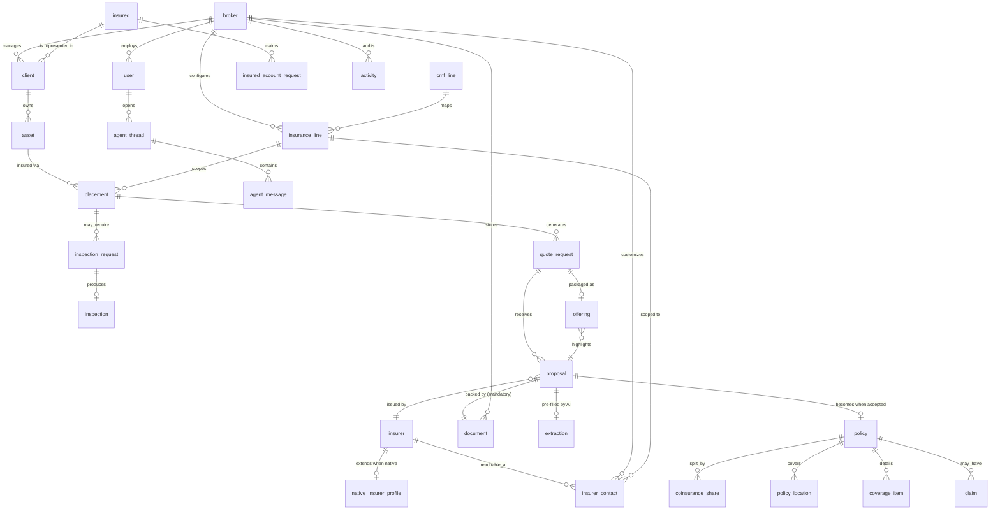

# Radal v2 — Architecture & Data Model

> **Status:** design spec for the v2 rebuild. Supersedes `data-model.md`, `data-model-v2.md`
> and `architecture.md` (v1, Spanish-named, broker-as-tenant-Radal).
>
> **Rule:** all code, database identifiers, comments and infrastructure names are **English**.
> The **UI default language is Spanish (es-CL)**, English secondary — handled entirely by i18n.
> Domain terms map: corredora→`broker`, asegurado→`insured`, aseguradora→`insurer`,
> ramo→`insurance_line`, póliza→`policy`, cotización→`quote_request`, oferta/propuesta→`proposal`,
> siniestro→`claim`, inspección→`inspection`, bien asegurable→`asset`.

---

## 1. What changed (and why we rebuilt)

| v1 | v2 |
|---|---|
| Radal was a **broker tenant** | Radal is the **platform / software provider**. Brokers are the tenants. |
| Insurers were a per-tenant catalog | One `insurer` identity, flagged **native** (Radal commercial partner) or **external** (broker-supplied) |
| Policy-centric | **Proposal-centric** — the proposal is the unit of work, AI-standardized regardless of origin |
| Insured needed to hand over a code | **RUT is the identity.** Brokers are never blocked; the insured claims an account later |
| Spanish identifiers | **English** everywhere in code/DB |
| UI built first, backend retrofitted | **Model → API → UI.** A control exists only if it is wired. |

**Build principle:** no dead buttons. If a feature is out of scope for this pass, its control is
rendered **disabled with a "pronto" state**, never as a button that silently does nothing.

---

## 2. Actors

| Actor | Who | Access |
|---|---|---|
| **Platform** (Radal team) | Internal | Manages native insurers, approves insured account requests, global admin |
| **Broker** | The customer, **the tenant** | Full workspace: clients, assets, proposals, offerings. **Primary focus of this build.** |
| **Insured** | The broker's client | Mostly passive — receives offerings by WhatsApp/email. May later request an account (manual approval) |
| **Insurer** | Native partner or external company | Native: recommended + rich contacts. External: tracked from uploaded proposals |

---

## 3. Data model

### 3.1 Identity & organizations

```
platform_user            Radal internal staff (no broker_id)
broker                   THE TENANT. rut (unique), cmf_code, legal_name, trade_name,
                         status, logo_key, address, commune, region, phone, email
user                     id, broker_id (null for platform), insurer_id, insured_id,
                         email (unique), hashed_password, full_name, job_title,
                         user_type (platform|broker|insurer|insured), role, is_active, avatar_key
insured                  CANONICAL, cross-broker. rut (unique, mod-11 validated),
                         person_type (natural|legal), legal_name, trade_name, tax_activity,
                         email, phone, address, commune, region, logo_key
insurer                  CANONICAL. rut (unique), cmf_code (unique), legal_name, trade_name,
                         is_native (bool), status, logo_key, payment_url,
                         created_by_broker_id (null when seeded by Radal)
native_insurer_profile   1:1, ONLY when insurer.is_native = true.
                         insurer_id (PK/FK), commercial_agreement, onboarded_at,
                         managed_by_user_id, priority, sla_hours, notes
insurer_contact          insurer_id, broker_id (NULL = global default),
                         insurance_line_id (NULL = all lines),
                         name, email, phone, role, is_primary
```

**Why `insurer_contact` has two nullable FKs:** a native insurer has different contacts per broker
and per line. `NULL` = fallback. Lookup order: (broker+line) → (broker) → (line) → global.

### 3.2 Broker workspace

```
client                   The broker↔insured relationship + broker-PRIVATE CRM data.
                         broker_id, insured_id, status (prospect|onboarding|active|archived),
                         account_manager_id, source, since, internal_notes
asset                    broker_id, client_id, asset_type, name, address, commune, region,
                         attributes (JSON), status
insurance_line           broker_id (null = global), name, requires_inspection,
                         cmf_line_codes (JSON), min_fields (JSON), comparator_fields (JSON)
cmf_line                 Official CMF/FECU taxonomy (reference, global)
placement                The operating folder: asset + line + period.
                         broker_id, asset_id, insurance_line_id, client_id, period,
                         status (draft|inspection|pre_underwriting|quoting|negotiating|
                                 awarded|active|closed)
quote_request            broker_id, placement_id, declared_value_uf, line_items (JSON),
                         requested_coverages, desired_start, sent_at, due_at, priority, status
proposal                 ★ CENTER OF GRAVITY. broker_id, quote_request_id, insurer_id,
                         origin (native|external), source_document_id (MANDATORY),
                         net_premium_uf, taxable_premium_uf, exempt_premium_uf, vat_uf,
                         total_premium_uf, commission_pct, rates (JSON),
                         deductibles (JSON, per peril), coverages (JSON), exclusions (JSON),
                         validity_days, status (draft|submitted|accepted|rejected),
                         extraction_id, extraction_confidence, is_confirmed
inspection_request       broker_id, asset_id, placement_id, reason, urgency, target_date, status
inspection              broker_id, asset_id, inspection_request_id, inspector_id, version,
                         checklist (JSON), score, status
policy                   Created ONLY after a proposal is accepted.
                         broker_id, client_id, asset_id, placement_id, proposal_id, insurer_id,
                         policy_number, start_date, end_date, premium fields, status
coinsurance_share        policy_id, insurer_id, is_leader, percentage
policy_location          policy_id, name, address, insured_amount_uf, percentage
coverage_item            policy_id, kind (coverage|exclusion), description
claim                    broker_id, policy_id, client_id, asset_id, event_date, kind,
                         description, status, estimated_amount_uf, settled_amount_uf
offering                 The shareable package sent to the insured.
                         broker_id, quote_request_id, selected_proposal_id, share_token,
                         pdf_key, sent_via (whatsapp|email|download), sent_at
document                 Polymorphic. broker_id, entity_type, entity_id, s3_key, bucket,
                         original_name, mime_type, category, phase, uploaded_by_id
activity                 Audit trail. broker_id, user_id, action, entity_type, entity_id, description
note                     broker_id, entity_type, entity_id, author_id, body, is_internal
```

### 3.3 Access & AI

```
insured_account_request  RUT-based account claim. REQUIRES manual approval by the Radal team.
                         rut, requested_email, requested_by (self|broker), broker_id,
                         status (pending|approved|rejected), reviewed_by_id, reviewed_at, notes
                         Rule: only eligible if that RUT has minimum history (≥1 awarded placement).
extraction               AI job. document_id, model, prompt_version, raw_output (JSON),
                         parsed (JSON), confidence, status, error, created_at
agent_thread             broker_id, user_id, scope (proposal|general), entity_type, entity_id, title
agent_message            thread_id, role (user|assistant|tool), content, tool_calls (JSON), tokens
```

### 3.4 ER diagram



---

## 4. Key rules

### 4.1 Identity
- **RUT is the identity** for `insured` and `broker`; **RUT + CMF code** for `insurer`.
- All RUTs validated mod-11 and stored normalized (`BODY-DV`, no dots, uppercase K).
- A broker asserting a client is **never blocked** — `client` is created immediately and audited.
  Confidentiality is enforced by tenant scoping, not by a gate on the relationship.
- The **insured account** is a claim on a RUT, approved **manually by the Radal team**, and only
  eligible with minimum history. Once approved, the account sees data linked to that RUT.
  *(Field-level visibility rules — what is hidden from the insured, e.g. commission and internal
  notes — are deliberately deferred; the model keeps `internal_notes` / `commission_pct` separable
  so they can be gated later without migration.)*

### 4.2 Money (Chilean market — do not simplify)
```
net = taxable + exempt          # earthquake cover is VAT-exempt
vat = 0.19 × taxable            # NOT on net
total = net + vat
comprehensive_rate = taxable_rate + exempt_rate
```
All amounts in **UF**, stored numeric. Deductibles differ **by peril** (fire = % of loss;
earthquake = % of the insured amount of the affected item, with UF minimums) — stored as
structured JSON, and the comparator must surface the difference.

### 4.3 Proposals
- A proposal **cannot exist without its source document** — the file is mandatory context.
- **`insurer.cmf_code` and `insurer.rut` are mandatory** for a proposal to be valid.
- AI pre-fills; the broker **confirms before commit** (`is_confirmed`). Extraction confidence and
  the source document are always retained for traceability.
- Insurer matching is by **normalized CMF code / RUT — never by name** (OCR yields
  `HDI Seguros S.A.` / `HDI SEGUROS SA` / `H.D.I.`). No match → create as `is_native = false`.

### 4.4 Multi-tenancy
Every workspace table carries `broker_id` and every query is scoped to the authenticated user's
broker. `insured`, `insurer` and `cmf_line` are **cross-broker canonical** and reached only through
the broker's own `client` / `proposal` rows.

---

## 5. AI (DeepInfra, OpenAI-compatible)

`AI_BASE_URL=https://api.deepinfra.com/v1/openai` · `AI_API_KEY` from env · OpenAI Python SDK.

1. **Proposal processor** — upload → extract → normalize to the standard proposal schema →
   broker confirms. Standardization is what makes proposals comparable regardless of origin,
   and is the precondition for branded reports later.
2. **Proposal chat agent** — scoped to one proposal/quote: "compare these three", "what's excluded".
3. **Broker agent (MCP)** — general assistant over leads, clients, placements and documents.

Every AI write path is **suggest → human confirm → commit**. Nothing auto-commits.

---

## 6. S3 layout (clean bucket, official routes)

```
media/broker/{broker_id}/logo.webp            # 512×512 WEBP
media/user/{user_id}/avatar.webp
media/insurer/{insurer_id}/logo.webp
media/insured/{insured_id}/logo.webp

documents/{entity_type}/{entity_id}/{category}-{n}.{ext}
  entity_type ∈ broker|client|asset|inspection|proposal|policy|claim|placement

offerings/{offering_id}/offering.pdf          # branded package (stub for now)
extractions/{extraction_id}/raw.json          # AI audit trail
```

Existing dev bucket `radal-dev-185011028331` is **wiped** and rebuilt to these routes.

---

## 7. Scope of this pass

**Build fully working:** auth + RBAC, broker workspace (clients, assets, placements),
quote requests, **proposals with AI pre-fill**, insurer catalog (native/external + contacts),
inspections, documents/S3, offerings (share + stub PDF), settings, activity/audit.

**Deliberately disabled in the UI (visible, marked "pronto"):** policies & claims post-sale depth,
insured & insurer portals, billing, reports, renewals.

**Deferred (modelled, not built):** insured field-level visibility rules, insurer portal scoping
(closed-deal insurers see all; others see only their proposal + anonymized insured).

---

## 8. Infrastructure — unchanged

Lambda (backend + frontend containers, LWA) + CloudFront + RDS MySQL + ECR + S3, CI/CD via
GitHub Actions (Blacksmith) → ECR → `update-function-code`. All resource names are already English.
The four CloudFront→Lambda OAC constraints in `deployment.md` still apply — **do not regress them.**
Only change: add `AI_BASE_URL` / `AI_API_KEY` to the Lambda env.
