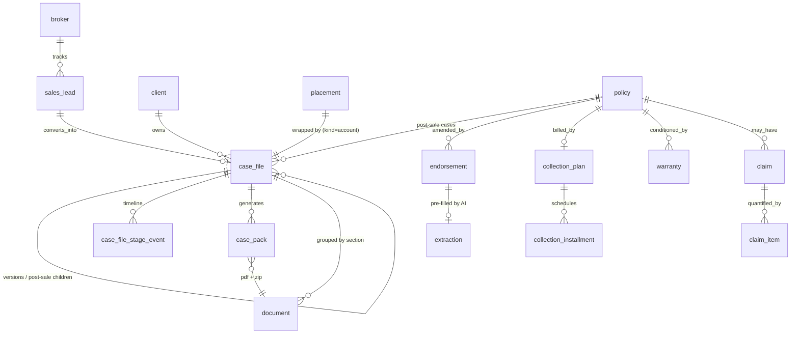

# Radal v2 — Case Files (Expedientes)

> ## ⚠️ Status: DESIGN SPEC — superseded on the details by the as-built doc
>
> This document was written **before** the implementation. The system was **built on
> 2026-08-19/20** in one multi-agent pass on branch `dev`.
>
> **The as-built truth lives in [`v2-case-files-as-built.md`](./v2-case-files-as-built.md)** —
> read that first. It carries the verified state (315 pytest passing, frontend build clean,
> 16 case files from the 168-document corpus), the "how to run it right now" recipe, the
> **delta table** of every place the build diverged from this spec and why, and the known gaps.
>
> This file stays as the **design record**: the reasoning, the shape rules, the field-by-field
> registry and the file-ownership map are all still accurate and still worth reading. Sections
> corrected after the build are marked **`[CORRECTED]`** inline; each correction is also listed
> in the as-built delta table rather than being silently rewritten here.

> **Status:** authoritative build spec for the case-file system. Extends `v2-architecture.md`
> (which stays the authority on actors, tenancy, money and S3) and applies the shape rule from
> `v2-data-modeling-decisions.md`. Nothing here supersedes those two — it adds.
>
> **Rule (unchanged):** every identifier is **English**. Spanish appears only as i18n locale
> *values* and inside **LLM prompts** (the source documents are Spanish — that is correct).
>
> **Change policy: ADDITIVE ONLY.** No column is dropped, no enum member removed, no existing
> route renamed. The 159 pytest tests must stay green throughout.

---

## 0. The idea in one breath

```
sales_lead  →  case_file(kind=account)  →  placement → quote_request → proposal → policy
                     │                                                              │
                     └── documents grouped by SECTION (root/submission/quotes/…)     │
                                                                                     │
              case_file(kind=endorsement | collection | claim | renewal) ────────────┘
                     versioned, sequenced, anchored to the policy AND to the account case
```

**The expediente is the folder the broker actually thinks in.** `placement` remains the operating
record for a new-business cycle (asset × line × period); `case_file` is the *narrative container*
around it — the thing that has a stage on the journey, a document tree with sections, notes, packs,
and post-sale children.

One `case_file(kind=account)` per placement. Post-sale case files hang off the resulting `policy`
and back-reference the account case, so the UI can render a sub-funnel on the policy: past →
current, each with dates.

---

## 1. Sections — the sub-expediente vocabulary

Derived 1:1 from the demo corpus folder tree (`EXPEDIENTES DEMO`, 169 files, 7 line expedientes).

| `CaseSection` value | Corpus folder | Direction of travel | Contains |
|---|---|---|---|
| `root_prospect` | *raíz del expediente* | insured → broker | 00A Solicitud del Prospecto |
| `submission` | `1. Subexpediente de Cotización (de Corredor a Compañías)` | broker → insurers | 00B ficha, 00C montos, 00D siniestralidad, 00E inspección, 01 bases técnicas, 02 carta de remisión, 03E plan de ingeniería, 03F re-remisión |
| `insurer_quotes` | `2. Subexpediente de Cotizaciones (de Compañías a Corredor)` | insurers → broker | 03/04/05/05B cotizaciones, 03A–C declinaciones, 03D pronunciamiento condicionado, 06 comparativo |
| `broker_proposal` | `3. Subexpediente de Propuesta` (both "a Compañía" and "a Asegurado") | broker → insurer / broker → insured | 07 propuesta de emisión, 07R recomendación técnica |
| `policy_file` | `4. Subexpediente de Póliza (interno Corredor)` | insurer → broker, internal | 08 póliza + real-format carrier policies |
| `collection` | `…/Subexpediente de Cobranza` | internal | 09/10 plan de pago y estado de cobranza |
| `endorsement` | `…/Subexpediente de Endoso` | both ways | 07A/07B/09C propuestas de endoso, 08A/08B/09B/09D endosos emitidos, 09A aviso de cumplimiento |
| `claim` | `…/Subexpediente de Siniestro` | both ways | 10/11 denuncio, 11/12 pre-informe, 12/13 informe final, 14 nota de cierre |
| `renewal` | *(no folder yet — modelled)* | internal | renewal review pack, prior-period evidence |

> Folder names vary in the corpus (`2. Subexpediente de Comparación…` for Viña Indómita,
> two distinct `3.` folders for La Favorita). The importer keys on the **leading ordinal and the
> nested folder name**, never on the exact string.

`CaseSection` is a shared enum in `app/models/enums.py`, used by `document.section`,
`case_pack.section` and the category registry.

---

## 2. New and changed tables

All new tables are **workspace** tables: `broker_id` NOT NULL, indexed, `ondelete="CASCADE"`.
`insured`, `insurer` and `cmf_line` remain canonical and untouched.

### 2.1 `sales_lead` — the data-point-only lead

> **Table name is `sales_lead`, not `lead`.** `LEAD` is a MySQL 8 reserved word (window function);
> a bare `lead` table would depend on the dialect quoting it. Verified against
> `sqlalchemy.dialects.mysql.base.RESERVED_WORDS_MYSQL`.

A lead exists *before* there is an insured RUT, so it is deliberately **not** a `client`.
No files, no placement — a tracked data point with notes and one follow-up date.

| Column | Type | Notes |
|---|---|---|
| `id` | PK | |
| `broker_id` | FK broker CASCADE, idx | |
| `name` | String(255) NOT NULL | trade name as the broker heard it |
| `rut` | String(16) NULL | normalized `BODY-DV` **when supplied**; mod-11 validated; never required |
| `contact_name` / `contact_email` / `contact_phone` | String(160)/(255)/(40) | |
| `source` | String(80) | referral, inbound, campaign… |
| `insurance_line_id` | FK insurance_line SET NULL | the line they asked about |
| `estimated_premium_uf` | `UF` | |
| `status` | `sql_enum(LeadStatus)` | `new · contacted · qualified · converted · lost` |
| `follow_up_on` | Date, idx with broker | the single date the team asked for |
| `owner_user_id` | FK user SET NULL | |
| `lost_reason` | String(255) | |
| `converted_client_id` | FK client SET NULL | filled on conversion |
| `converted_case_file_id` | FK case_file SET NULL | filled on conversion |
| `summary` | Text | |

Index: `ix_sales_lead_broker_status (broker_id, status)`, `ix_sales_lead_broker_followup (broker_id, follow_up_on)`.

**Advancing a lead** = `POST /leads/{id}/convert` → creates/attaches `insured` (by RUT) + `client` +
`placement` + `case_file(kind=account, stage=intake)` in one transaction, sets `status=converted`
and the two conversion FKs. Attaching the 00A document is what the UI drives the user to do next.

### 2.2 `case_file` — the expediente

| Column | Type | Notes |
|---|---|---|
| `id` | PK | |
| `broker_id` | FK broker CASCADE, idx | |
| `client_id` | FK client RESTRICT, idx | always known once the case exists |
| `placement_id` | FK placement SET NULL, idx | NULL for post-sale-only cases |
| `policy_id` | FK policy SET NULL, idx | set for `endorsement / collection / claim / renewal` |
| `parent_case_file_id` | FK case_file SET NULL, idx | post-sale → its account case |
| `supersedes_case_file_id` | FK case_file SET NULL | previous **version** of the same case |
| `insurance_line_id` | FK insurance_line SET NULL | |
| `kind` | `sql_enum(CaseFileKind)` NOT NULL | `account · endorsement · collection · claim · renewal` |
| `stage` | `sql_enum(CaseStage)` NOT NULL | the journey machine, §5 |
| `status` | `sql_enum(CaseFileStatus)` NOT NULL | `open · on_hold · won · lost · cancelled · closed` |
| `reference` | String(64), idx | human code, e.g. `EXP-2026-0007`; unique per broker |
| `title` | String(255) NOT NULL | |
| `sequence_no` | Integer NOT NULL default 1 | ordinal within `(policy_id, kind)` — E1, E2… |
| `version` | Integer NOT NULL default 1 | rework counter of *this* case |
| `owner_user_id` | FK user SET NULL | |
| `opened_at` | DateTime NOT NULL default utcnow | |
| `due_at` / `closed_at` | DateTime NULL | |
| `summary` | Text | broker-written or AI-suggested-then-confirmed |
| `meta` | `JSONType` | per-kind tail (e.g. renewal target date, declination tally) |

Constraints: `UniqueConstraint(broker_id, reference)`,
`Index(broker_id, kind, stage)`, `Index(broker_id, policy_id, kind, sequence_no)`,
`Index(broker_id, status, due_at)`.

**Why `sequence_no` *and* `version`:** endorsement E1 and E2 are two *different* cases on the same
policy (`sequence_no` 1 and 2). Re-working E2 after the insurer bounces it produces a new
`case_file` row with the same `sequence_no=2`, `version=2`, and `supersedes_case_file_id` pointing
at v1 — this is the "past → current with dates" sub-funnel the team asked for. No unique constraint
across `(policy_id, kind, sequence_no, version)`: NULL `policy_id` behaves differently per engine
and the invariant is cheap to enforce in the service.

**Why not reuse `placement`:** `placement` is scoped to one asset × line × period and has no
concept of post-sale, sections, or versions. The account case wraps it 1:1; every other kind has no
placement at all.

### 2.3 `case_file_stage_event` — the timeline

Child table (we list it, order it and compute durations from it — not JSON).

`id · broker_id · case_file_id (CASCADE, idx) · from_stage (nullable CaseStage) · to_stage (CaseStage NOT NULL) · occurred_at (DateTime NOT NULL) · user_id (FK user SET NULL) · note (Text) · meta (JSON)`

Index `(case_file_id, occurred_at)`.

### 2.4 `case_pack` — the generated downloadable

`id · broker_id · case_file_id (CASCADE, idx) · kind (sql_enum(PackKind): submission | comparison | proposal) · section (CaseSection) · status (sql_enum(PackStatus): draft | generating | generated | sent | failed) · pdf_document_id (FK document SET NULL) · zip_document_id (FK document SET NULL) · summary (Text) · summary_model (String(120)) · summary_prompt_version (String(64)) · is_summary_confirmed (Boolean default False) · recipients (JSON snapshot) · generated_at · sent_at · generated_by_id (FK user SET NULL) · error (Text)`

`recipients` is a **snapshot** (same reasoning as `quote_request.recipient_insurer_ids`): the
resolved insurer contacts at send time, so re-resolving later cannot rewrite history.

### 2.5 `endorsement`

| Column | Type | Notes |
|---|---|---|
| `id` | PK | |
| `broker_id` | FK broker CASCADE, idx | |
| `policy_id` | FK policy RESTRICT, idx | an endorsement cannot exist without its policy |
| `case_file_id` | FK case_file SET NULL, idx | |
| `endorsement_number` | String(64) | carrier folio, verbatim (`791237-4`) |
| `sequence_no` | Integer NOT NULL | 1, 2 … per policy |
| `kind` | `sql_enum(EndorsementKind)` | 14 members, §2.5.1 |
| `status` | `sql_enum(EndorsementStatus)` | `draft · proposed · issued · applied · rejected · cancelled` |
| `effective_at` / `ends_at` | DateTime | **noon convention is contractual** — never a bare Date |
| `issued_at` | Date | can precede `effective_at` |
| `proposal_document_id` | FK document SET NULL | 07A/07B/09C |
| `issued_document_id` | FK document SET NULL | 08A/08B/09B/09D |
| `motive` | Text | verbatim; the capitalised verb (INCLUYE/EXCLUYE/AUMENTA…) is the signal |
| `contractual_basis` | String(255) | resolves back to a particular clause number |
| `insured_amount_delta_uf` | `UF` | |
| `taxable_premium_delta_uf`, `exempt_premium_delta_uf`, `net_premium_delta_uf`, `vat_delta_uf`, `total_premium_delta_uf`, `commission_delta_uf` | `UF` | **columns** — fixed shape in every one of the 14 corpus endorsements, and we sum them into collection |
| `prorata_days`, `unexpired_days` | Integer | numerator/denominator of the delta |
| `effect` | `JSONType` | the before/after/delta table — shape varies per kind |
| `deductibles` | `JSONType` | replacement deductible set when the endorsement changes it |
| `extraction_id` | FK extraction SET NULL | AI provenance |
| `extraction_confidence` | `PCT` | |
| `is_confirmed` / `confirmed_by_id` / `confirmed_at` | | suggest → confirm → commit |

Money invariant, enforced in the schema layer exactly as for a proposal, sign-preserving:

```
net_delta   = taxable_delta + exempt_delta
vat_delta   = 0.19 × taxable_delta          # NOT on net
total_delta = net_delta + vat_delta
```

An administrative endorsement (pledge update, policyholder change) is all-zero — that is valid and
must not trip the validator.

#### 2.5.1 `EndorsementKind`

`location_inclusion · location_exclusion · vehicle_inclusion · vehicle_exclusion ·
additional_insured · activity_extension · aggregate_reinstatement · roster_increase ·
roster_adjustment · pledge_update · policyholder_change · sum_insured_increase ·
sum_insured_decrease · deductible_reduction · other`

### 2.6 `collection_plan` + `collection_installment`

`collection_plan`:
`id · broker_id · policy_id (CASCADE, idx) · case_file_id (SET NULL) · plan_number (String(64)) ·
payment_mode (sql_enum(PaymentMode): coupon_book | direct_debit | card_debit | transfer | single_charge | other) ·
installment_count (Integer) · total_premium_uf (UF) · bank (String(120)) · account_number (String(64)) ·
monthly_interest_rate_pct (PCT) · status (sql_enum(CollectionPlanStatus): pending | current | overdue | settled | suspended | terminated | rehabilitated) ·
as_of_date (Date) · terminated_at (DateTime) · rehabilitated_at (DateTime) · days_without_cover (Integer) ·
rehabilitation_cost_uf (UF) · art528_events (JSON) · management_note (Text)`

`collection_installment` — **child table** (we sum, filter by status and compute arrears):
`id · broker_id · collection_plan_id (CASCADE, idx) · number (Integer) · coupon_number (String(32)) ·
due_date (Date, idx) · gross_amount_uf (UF NOT NULL) · net_premium_uf (UF) · commission_uf (UF) ·
paid_on (Date) · days_late (Integer) · status (sql_enum(InstallmentStatus): pending | due | paid | paid_late | overdue | credited | cancelled) ·
endorsement_id (FK endorsement SET NULL) · note (Text)`

Rule (from the corpus, every plan): **Σ `gross_amount_uf` == policy gross premium + Σ endorsement
`total_premium_delta_uf`**, with the last instalment absorbing rounding. Validated in the schema
layer with the existing `MONEY_TOLERANCE`; a mismatch is **422**, never a silent fix.

### 2.7 `warranty` — the R-n / G-n / M-n tracker

The single highest-value post-sale structure in the corpus: the same code threads through
inspection → policy → collection tracker → claim notice → adjuster report → endorsement.

`id · broker_id · policy_id (CASCADE, idx) · case_file_id (SET NULL) · code (String(16), idx: "R-1","G-4","M-5") ·
title (String(255)) · requirement (Text, verbatim) ·
source (sql_enum(WarrantySource): inspection_recommendation | underwriting_warranty | engineering_measure) ·
category (String(4)) — the inspection's A/B/C/D letter ·
deadline_days (Integer) · due_date (Date, idx) · is_permanent (Boolean) · is_suspensive (Boolean) ·
status (sql_enum(WarrantyStatus): pending | in_progress | met_on_time | met_late | met_after_claim | breached | waived) ·
completed_on (Date) · verification (Text) · budget_uf (UF) · actual_cost_uf (UF) ·
evidence_document_id (FK document SET NULL) · sort_order (Integer)`

### 2.8 `claim_item` — per-partida damage

Child of the existing `claim`; the adjuster's tables are 1:N and every column is summed.

`id · broker_id · claim_id (CASCADE, idx) ·
kind (sql_enum(ClaimItemKind): material_damage | business_interruption | expense | liability | personal_accident | recovery) ·
item (String(255)) · basis (Text) · notified_uf · determined_uf · damage_uf · deductible_uf · indemnity_uf (all `UF`) ·
sort_order (Integer) · note (Text)`

### 2.9 Additive columns on existing tables

**No existing column changes type or nullability.**

| Table | New columns |
|---|---|
| `document` | `case_file_id` FK case_file SET NULL idx · `section` `sql_enum(CaseSection)` NULL · `document_code` String(8) NULL (the corpus code hint: `00A`, `07R`, `09B`) |
| `placement` | `case_file_id` FK case_file SET NULL (convenience back-pointer; the authority is `case_file.placement_id`) |
| `policy` | `case_file_id` FK SET NULL · `source_document_id` FK document SET NULL · `renews_policy_id` self-FK SET NULL · `period_start_at` / `period_end_at` DateTime (the 12:00 convention; the existing `start_date`/`end_date` stay and are kept in sync) · `cover_mode` String(64) · `cmf_policy_code` String(32) · `insured_amount_semantics` String(255) · `aggregate_limit_uf` UF · `average_rate_permille` `RATE` · `indemnity_limit` Text |
| `claim` | `case_file_id` FK SET NULL · `occurred_at` / `reported_at` DateTime (hour-level; the existing Dates stay) · `notice_deadline_days` Integer · `adjuster_name` String(160) · `adjuster_registry` String(32) · `coverage_ruling` `sql_enum(ClaimRuling)` (`pending · covered · partially_covered · rejected`) · `deductible_uf` UF · `loss_ratio_pct` PCT |
| `proposal` | `case_file_id` FK SET NULL · `ai_summary` Text · `ai_summary_model` String(120) · `ai_summary_prompt_version` String(64) · `is_summary_confirmed` Boolean default False · `quotation_number` String(64) · `cover_mode` String(64) · `outcome` `sql_enum(ProposalOutcome)` NULL (`quoted · declined · conditional · no_response`) |
| `quote_request` | `case_file_id` FK SET NULL · `round_no` Integer default 1 (La Favorita's second round) |
| `inspection` | `case_file_id` FK SET NULL |
| `extraction` | `case_file_id` FK SET NULL · `category` `sql_enum(DocumentCategory)` NULL (which registry schema produced it) |
| `note` | `follow_up_on` Date NULL — the team asked for notes **with** a follow-up date; `note` already has `broker_id`, `entity_type/entity_id`, `is_internal`, `phase` |

### 2.10 Enum additions

**`EntityType`** — add `CASE_FILE = "case_file"`, `SALES_LEAD = "sales_lead"`, `ENDORSEMENT = "endorsement"`,
`COLLECTION_PLAN = "collection_plan"`, `WARRANTY = "warranty"`.
Longest value stays `inspection_request` (18) → the computed VARCHAR length is unchanged at 30.
These make notes, activities and documents attachable to the new entities and keep the S3 route
`documents/{entity_type}/{entity_id}/…` honest.

**`DocumentCategory`** — 26 new members (§3), 15 → **41 total**. The longest becomes
`conditional_pronouncement`, so the computed length grows **29 → 37** *`[CORRECTED]` — the draft
said 29 → 36; the arithmetic came out one wider*. On MySQL this is a widening
`ALTER TABLE … MODIFY`, which is safe and online; on a fresh local SQLite DB `create_all` handles
it. **Deployment note `[CORRECTED]`:** neither `--reset` nor a hand-written statement is needed —
**`backend/scripts/migrate_case_files.py`** emits the whole plan (new tables, 38 added columns,
both widenings, indexes, FKs) compiled from the live metadata. See
`docs/deployment.md` § "Schema migration — case-files pass". **It has NOT been run against
`radal-dev-db` yet and must run before the first push to `dev`.**

**`ExtractionKind`** — add `case_document`, `summary`. Longest becomes `case_document` (13) →
length 22 → 25 (same widening note).

**New enums** (all `sql_enum(...)`, `native_enum=False`, `validate_strings=True`, English values):
`CaseSection`, `CaseFileKind`, `CaseStage`, `CaseFileStatus`, `LeadStatus`, `PackKind`, `PackStatus`,
`EndorsementKind`, `EndorsementStatus`, `PaymentMode`, `CollectionPlanStatus`, `InstallmentStatus`,
`WarrantySource`, `WarrantyStatus`, `ClaimItemKind`, `ClaimRuling`, `ProposalOutcome`,
`DocumentDirection`.

### 2.11 ER additions



---

## 3. Document category registry

**One canonical English enum**, merged from both analyst taxonomies (their overlapping slugs are
deduped: `risk_inspection_report`→`inspection_report`, `technical_basis`→`technical_brief`,
`business_profile_questionnaire`→`business_questionnaire`, `loss_history_certificate`→`loss_history`,
`conditional_underwriting_statement`→`conditional_pronouncement`,
`guarantee_compliance_notice`→`compliance_notice`).

`proposal` is **kept and deprecated**: it is the category the current AI upload flow writes for an
insurer quotation. The registry maps it to the same spec as `insurer_quotation`, so
`pages/proposals/upload.tsx` and the 159 tests keep working unchanged. New code writes
`insurer_quotation`.

Every row is a `CategorySpec` in `app/schemas/extraction/registry.py`:

```python
@dataclass(frozen=True)
class CategorySpec:
    category: DocumentCategory
    code: str | None                 # corpus code hint, e.g. "00A"
    section: CaseSection
    direction: DocumentDirection
    schema: type[BaseModel]          # the Pydantic extraction schema
    module: str                      # "app.schemas.extraction.prospect_request"
    prompt_version: str              # "<slug>-v1"
    guidance: str                    # SPANISH prompt guidance (allowed: LLM prompt)
    prefill_target: str              # what a confirmed extraction writes
    extraction_kind: ExtractionKind
```

`CATEGORY_REGISTRY: dict[DocumentCategory, CategorySpec]` plus `spec_for(category)` and
`CODE_TO_CATEGORY: dict[str, DocumentCategory]` (used by the importer and by upload auto-detection).

> **`[CORRECTED]` — two things about §3.1 as built:**
>
> 1. **`CategorySpec.code` is a single canonical hint**, not the multi-code strings written in the
>    table below (`payment_plan` = `09`, `collection_status` = `10`, `claim_notice` = `11`,
>    `claim_preliminary_report` = `12`, `claim_final_report` = `13`, `insurer_quotation` = `03`,
>    `declination` = `03A`, `endorsement_proposal` = `07A`, `endorsement` = `08A`). The
>    many-codes-to-one-category mapping lives in `CODE_TO_CATEGORY` (35 codes → 25 categories),
>    which is what the importer and upload auto-detection actually read. The registry has **26
>    entries**: 25 distinct categories + the deprecated `proposal` alias. The three `*_pack`
>    categories are generated, not extracted, and are **not** in the registry.
> 2. **The "Prefill target" column describes intent, not an automatic write.** At confirm time
>    (`app/services/extraction_commit.py`) only **14** categories commit to an entity; the other
>    **10** — `business_questionnaire, insured_values_schedule, loss_history,
>    risk_engineering_plan, declination, conditional_pronouncement, quote_comparison,
>    issuance_proposal, technical_recommendation, broker_closing_note` — are **informational-only**
>    and return a reason string instead. A declination is an insurer that *did not quote*:
>    fabricating a `proposal` row for it would corrupt the comparator. A confirmed 07
>    (`issuance_proposal`) **is** the mirror baseline — `mirror.py` reads the payload directly
>    rather than copying it into a table. See as-built delta #1.
> 3. `insurer_quotation` keeps `prompt_version = "proposal-extract-v1"` (not
>    `insurer_quotation-v1`), which is what makes the pre-existing proposal-upload path
>    byte-identical.

### 3.1 The registry

| Category | Code | Section | Direction | Extraction schema — key fields | Prefill target |
|---|---|---|---|---|---|
| `prospect_request` | 00A | root_prospect | insured→broker | letter_date, letter_city, received_by_broker_date, insured (legal_name, rut, trade_name), signer{name,role,email,phone}, broker_legal_name, insurance_line_hint, current_policy{number,insurer,endorsement_number,expiry_date}, current_incumbent_broker, declared_insured_amount_uf, trigger_event{description,date,loss_uf,outcome}, concerns[], requests[], minimum_insurers_requested, new_locations_declared[], attachments[], site_visit_offered | `client` + contacts + `placement` intake + document checklist |
| `business_questionnaire` | 00B | submission | insured→broker | form_date, insured{legal_name,rut}, commercial_account_name, business_activity, economic_activity_code, commercial_address, legal_representative{name,rut}, policy_contact{}, company_age_years, employee_count, annual_revenue_uf, contribution_margin_plus_fixed_costs_uf, locations[], construction_and_protection[], fleet[], authorized_drivers[], employee_roster[], risk_profiles[], questionnaire[] (open Q&A), third_party_goods_uf, pledges_leasing_creditors, declaration_text, signed_by | `client` master data + `asset` (10 promoted cols + `attributes` JSON) + questionnaire JSON on the placement |
| `insured_values_schedule` | 00C | submission | broker internal→insurers | sheet_titles[], insurance_line, currency, valuation_basis, valuation_date, value_matrix[] (dynamic partida→amount map), total_physical_assets_uf, business_interruption{uf,basis,months,deductible}, program_total_insured_value_uf, asset_inventory[], stock_by_month[], current_vs_valued_comparison[], underinsurance{amount_uf,pct}, proportional_rule_factor, fleet_schedule[], liability_scenarios[], limit_dimensioning_conclusion{}, personnel_capitals[], cumulus_analysis[], secured_creditor_amount_uf | `asset` value schedule + `quote_request.declared_value_uf` + `quote_line_item` rows |
| `loss_history` | 00D | submission | insurer→broker | insured{}, insurance_line, periods_covered, years_covered, issuing_insurer, issue_date, source_system, claims[] (period,date,description,amount_uf,coverage,status), totals{reported,indemnified,rejected,recoveries,reserves}, accumulated_gross_premium_uf, loss_ratio_pct, claim_frequency, average_severity_uf, broker_observation | historical `claim` rows (status-only) + loss-ratio KPIs on the case |
| `inspection_report` | 00E | submission | third_party→broker | report_folio, inspection_company, requesting_party, scope, visit_date, report_date, inspector{name,credential}, reference_standards[], executive_summary, module_scores[], weighted_technical_score, risk_class, verdict, construction_by_location[], fire_protection_matrix[], combustible_load[], theft_protection_matrix[], exposure_scenarios[], mfl_uf, pml_uf, regulatory_compliance[], recommendations[] (code,category,deadline,type,cost_uf), reinspection_days, projected_score_after_recommendations, inspector_conclusion | `inspection` (scores→columns, checklist→JSON, boundaries→child) + `warranty` rows from category-A recommendations |
| `technical_brief` | 01 | submission | broker→insurers | document_date/city, insurance_line, cover_mode, alternative_cover_mode_requested, policy_period_start/end (datetime, noon), broker_commission_pct, insured{}, locations[], insured_values_by_location[], total_program_insured_value_uf, indemnity_limit, indemnity_basis, requested_coverages[] (n,name,requested_limit prose), requested_deductibles[] (peril, prose), deductible_policy_note, exclusions[], gaps[] (code,title,severity), warranties_accepted[], causality_clause_requested, quoting_instructions[], offer_deadline, award_date_estimated, loss_history_summary[], exposure_summary[], inspection_folio_reference, annexes[], decisive_coverages[] | `quote_request` header + requested coverages/deductibles + `placement.brief_document_id`; opens the submission |
| `submission_letter` | 02 | submission | broker→insurers | letter_date/city, broker{}, broker_signer, addressee_insurers[], addressee_department, insured{}, insurance_line, requested_inception_date, placement_type, folder_contents[], key_underwriting_points[], quotation_requests[], offer_deadline, award_date_estimated, site_visit_offer | `quote_request` dispatch: `recipient_insurer_ids`, `sent_at`, `due_at`; one pending proposal slot per addressee |
| `risk_engineering_plan` | 03E | submission | broker+insured→insurers | document_date, insured{}, origin_inspection_folio, total_investment_uf, total_duration_days, plan_start_date, score_before/after, class_before/after, measures[] (code,scope,deadline_days,cost_uf,provider,quote_reference), verification_milestones[], gantt_by_month[], financing[], decision_arithmetic[], deductible_reduction_mechanism{}, insured_commitments[], signers{} | `warranty` rows with `source=engineering_measure` + budget/deadline |
| `resubmission_letter` | 03F | submission | broker→insurers | letter_date, round_number, insured{}, insurance_line, proposed_insured_amount_uf, requested_inception_date, quote_deadline, addressee_insurers[], round_one_responses[] (insurer,response,grounds), first_round_dispatch_date, new_evidence[], per_insurer_ask[], deductible_structure_requested, award_criteria[], closing_argument | `quote_request.round_no += 1`; per-insurer `proposal.outcome` |
| `insurer_quotation` (alias: `proposal`) | 03/04/05/05B | insurer_quotes | insurer→broker | quotation_number, issue_date, insurer{legal_name,rut?}, policyholder{}, insurance_line, cover_mode, policy_conditions_code, indemnity_limit, period_start/end (datetime), validity_days, accepted_values_by_location[], total_accepted_uf, coverages[] (n,name,requested_limit,offered_condition — verbatim), sublimit_application_rules[], deductibles[] (peril,requested,offered), dual_deductible{}, premium_by_item[], net_premium_taxable_uf, net_premium_exempt_uf, net_premium_total_uf, vat_uf, gross_premium_uf, broker_commission_pct/uf, average_rate, exclusions[], warranties[], inspection_acceptance, underwriting_observations[], payment_plan_offered | **`proposal`** (money→columns, deductibles→JSON, coverages→`proposal_coverage`) — the existing flow, unchanged |
| `declination` | 03A/B/C | insurer_quotes | insurer→broker | pronouncement, pronouncement_date, insurer{}, insured{}, submission_reference_date, insurance_line, requested_amount_uf, existing_policy_with_this_insurer{}, declination_reasons[] (n,reason,rationale), renewal_offer_on_existing_terms, non_renewal, final_remarks | `proposal` with `status=rejected`, `outcome=declined`, reasons in `notes` + `meta` |
| `conditional_pronouncement` | 03D | insurer_quotes | insurer→broker | pronouncement, pronouncement_date, insurer{}, insured{}, requested_amount_uf, rationale, pre_quotation_measures[], post_issuance_warranty_measures[], coverage_anticipations[], deductible_mechanism_response, anticipated_conditions[], inspection_folio_accepted, reinspection_required, quoting_sla_business_days | `proposal.outcome=conditional` + `warranty` rows (pre-quotation vs post-issuance) |
| `quote_comparison` | 06 | insurer_quotes | broker→insured | comparison_date, insured{}, insurance_line, quoted_period, offers_compared[], methodological_warning, economic_summary[], central_finding, gap_resolution_matrix[], coverage_comparison[], deductible_comparison[], scenario_simulation[], cover_mode_comparison[], weighted_evaluation[], recommended_offer{}, recommendation_rationale[], pre_issuance_actions[], broker_signer | `case_pack(kind=comparison)` summary + `proposal.ai_summary` seeds; recommended offer highlighted |
| `issuance_proposal` | 07 | broker_proposal | broker→insurer | document_date/city, addressee_insurer, accepted_quotation_number/date, mirror_validation_clause, policyholder{}, beneficiaries[], secured_creditor_amount_uf, broker{}, insurance_line, cover_mode, replaced_policy, period_start/end (datetime), indemnity_limit/basis, territory, insured_subject_matter[], insured_values_by_partida[], total_insured_amount_uf, sublimits[], coverages_to_issue[], deductibles_to_issue[], exclusions_to_issue[], particular_clauses[], warranties[], causality_clause, premium_by_item[], net_taxable/exempt/total, vat_uf, gross_uf, commission{}, payment_plan{}, instalments[], prior_policy_refund_uf, insured_declarations[], accompanying_documents[], issuance_deadline, signer | the winning `proposal` promoted + the **mirror baseline** for the issued policy |
| `technical_recommendation` | 07R | broker_proposal | broker→insured | document_date, insured{}, insured_representative, proposed_insurer, quotation_number, insured_amount_uf, period_start/end, gross_annual_premium_uf, payment_form, narrative_origin, market_process_narrative, program_summary[], gap_resolution[], cost_benefit_comparison[], premium_increase_uf/pct, insured_obligations[], deductible_reduction_path, alternatives[], placement_order_text, signature_blocks{} | `case_pack(kind=comparison)` insured-facing summary; signing advances the case to `proposal_issued` |
| `policy` | 08 | policy_file | insurer→broker | policy_number, renews_policy_number, insurer{}, line_of_business, coverage_modality, policyholder{}, insured{}, broker{}, cmf_policy_code, cmf_additional_clause_codes[], market_clause_codes[], period_start_at/end_at (datetime), currency, issue_date/place, source_proposal_date, source_quote_reference, mirror_issuance_statement, locations[], insured_amounts[], total_insured_amount_uf, valuation_basis, indemnity_limit, aggregate_limit_uf, reinstatement{}, vehicles[], drivers[], workers[], ap_plans[], accumulation_per_event/period_uf, pledge_creditor[], coverages[], sublimits[], deductibles[], exclusions[], particular_clauses[], warranties[], premium_lines[], net_taxable/exempt/total, vat_uf, gross_uf, commission{}, payment_mode, installments[] | **`policy`** + `policy_location` + `coverage_item` + `warranty` + `collection_plan`/`collection_installment`; **mirror-diff mode** against the confirmed `issuance_proposal` |
| `payment_plan` | 09/plan | collection | insurer→broker | payment_plan_number, policy_number, insurer, policyholder{}, responsible_payer{}, total_premium_uf, payment_mode, installment_count, installments[] (number,coupon,due_date,gross_uf,net_uf,commission_uf), monthly_interest_rate_pct, uf_conversion_clause, nonpayment_clause, forms_part_of_policy, endorsement_payment_plan{} | `collection_plan` + `collection_installment` |
| `collection_status` | 09/10 | collection | internal | document_variant, as_of_date, policy_number, insurer, account_name, insured{}, policy_period{}, original_gross_premium_uf, payment_mode, charge_account, pledge_creditor{}, premium_composition[] (signed), total_period_gross_uf, installments[] (status,paid_on,days_late), situation_summary{}, incidents[], coverage_termination{}, art528_events[], commission[], warranty_status[], active_alerts[], aggregate_limit_control[], roster_and_accumulation_control[], engineering_plan_control[], verification_cycle_milestones[], management_note | `collection_plan` status + instalment statuses + `warranty.status` + case alerts |
| `endorsement_proposal` | 07A/07B/09C | endorsement | broker→insurer | proposed_endorsement_number, endorsement_type, addressed_to, issuer_broker{}, proposal_date/place, signer{}, policy_number, insured{}, policy_period{}, contractual_basis, requested_effective_at/end_at, motive_text, state_before{}, added_location{}/added_vehicle{}/added_workers[]/added_insured{}, item_amounts[], bi_change_uf, total_added_uf, total_removed_uf, effect_table[], endorsement_days, unexpired_days, rates_applied{}, additional_net_taxable_uf, additional_net_exempt_uf, additional_net_premium_uf, vat_uf, additional_gross_premium_uf, broker_commission_delta_uf, charging_instruction, reinstatement_calculation{}, pledge_update{}, policyholder_change{}, attachments[], statements[], broker_observation | `endorsement` with `status=proposed` + `proposal_document_id` |
| `endorsement` | 08A/08B/09B/09D | endorsement | insurer→broker | endorsement_number, endorsement_document_number, policy_number, insurer, endorsement_type, prior_endorsements[], claims_in_period[], policy_period{}, endorsement_effective_at/end_at, issue_date, motive_text, same_terms_statement, amounts_moved[], post_endorsement_schedule[], premium_movement[], premium_impact_none, charging_instruction, deductible_changes[], guarantee_modifications[], reinspection_result{}, reversal_right, pledge_clause_stipulations[], pledged_partitions[], roster_change{}, element_change_table[], creditor_authorization{}, notary_reference{}, special_conditions[], coverage_cessation_statement | `endorsement` → `status=issued`, applies deltas to `policy` + `collection_plan` on confirm |
| `compliance_notice` | 09A | endorsement | broker→insurer | addressed_to, issuer_broker, policy_number, insured{}, subject, contractual_basis, notice_date, reinspection_deadline, measures_completed[], full_plan_status[], total_budget_uf, total_actual_uf, overrun_pct, requests[], signer{} | `warranty.status` + `completed_on` + opens the expected `endorsement(status=draft)` |
| `claim_notice` | 10/11 | claim | broker→insurer | claim_number, policy_number, insurer, insured{}, affected_location{}, occurrence_at (datetime), notice_at, knowledge_date, notice_deadline_days, claim_modality, narrative_text, timeline[], probable_cause_text, mitigating_elements[], declared_damages[], subtotal_material_damage_uf, debris_removal_uf, professional_fees_uf, total_estimated_uf, operational_situation{}, invoked_coverages[] (resolve to `coverage_item.number`), affected_workers[], accumulation_analysis{}, claimants[], product_recall{}, vehicle{}, driver{}, third_parties[], police_report{}, mitigation_measures[], attachments[], broker_requests[] | `claim` + `claim_item(kind=…)` + tasks from `broker_requests` |
| `claim_preliminary_report` | 11/12 | claim | adjuster→parties | claim_number, policy_number, adjuster{name,company,cmf_registry}, appointment_date, first_inspection_date, report_date, legal_basis, experts_ordered[], coverage_verification[], preliminary_ruling, warranty_analysis[], warranty_extension{}, cause_expertise{}, damage_quantification[] (notified→determined), bi_methodology{}, preliminary_settlement[], advance_payment_recommendation{}, pledge_creditor_application{}, coverage_termination_effect{}, hourly_franchise_analysis{}, total_loss_analysis{}, pending_diligences[] | `claim.coverage_ruling` + `claim_item.determined_uf` + `warranty.status` |
| `claim_final_report` | 12/13 | claim | adjuster→parties | claim_number, adjuster{}, report_date/place, occurrence_date, notice_date, days_since_notice, coverage_ruling, covered_coverages[], exclusion_ruling, warranty_ruling, final_material_damage[], total_material_damage_uf, proportional_rule{}, bi_determination{}, deductibles_applied[], limit_verification[], settlement{}, ap_settlement[], medical_commission[], accumulation_application{}, rc_claim_closures[], recall_costs[], rc_settlement{}, aggregate_effect{}, insurer_total_cost{}, recovery{}, account_loss_ratio{}, risk_engineering_effect[], prior_program_counterfactual[], alternatives_counterfactual[], subrogation{}, conclusions[], liquidation_duration_days | `claim` closure columns + `claim_item` final figures + `claim.loss_ratio_pct` |
| `broker_closing_note` | 14 | claim | broker→insured | addressed_to{}, issuer_broker, signer{}, subject, note_date, claim_number, policy_number, renewal_date, paid_amount_uf, payment_date, days_from_notice_to_payment, deductibles_borne_uf, total_damage_uf, claim_history[], decisive_factors[], renewal_context{}, negotiation_position[], renewal_actions_requested[], closing_message | `claim` closure summary + seeds `case_file(kind=renewal)` with dated actions |
| `submission_pack` | — | submission | broker→insurers | *(generated, not extracted)* | `case_pack(kind=submission)` |
| `comparison_pack` | — | insurer_quotes | broker→insured | *(generated)* | `case_pack(kind=comparison)` |
| `proposal_pack` | — | broker_proposal | broker→insurer | *(generated)* | `case_pack(kind=proposal)` |

Existing categories kept unchanged and mapped to `section=None` unless a case supplies one:
`cmf_certificate, appointment, logo, asset_sheet, asset_photo, valuation, insured_amounts, evidence,
technical_brief, claims_history, proposal (deprecated alias), power_of_attorney, offering, other`.

### 3.2 Extraction rules that apply to every schema

1. **Money is UF, Chilean-formatted.** `"UF 17.920"` → `17920`, `"UF 12,99"` → `12.99`.
   `.` is the thousands separator, `,` the decimal. Negative amounts may use U+2212 `−`.
   A shared `parse_uf()` / `parse_pct()` validator lives in `app/schemas/extraction/common.py`.
2. **`net = taxable + exempt` · `vat = 0.19 × taxable` · `total = net + vat`.** Every schema with a
   premium block reuses the existing `reconcile_money` helper contract. Mismatch → warning on the
   suggestion, **never** a silent correction, and **422** only at confirm time.
3. **Prose survives verbatim.** Deductible strings, coverage limits, exclusion carve-backs, pledge
   stipulations and the broker's narrative blocks are stored as text *alongside* any parsed
   numbers. In the two corpus cases that decided coverage (the 60-day manifestation window, the
   4-hour franchise) the exact wording **is** the coverage.
4. **Never reconcile across documents.** The 00B VIN differs from the 07 VIN; the real Southbridge
   policy says 6 months where the mirror says 12. Each extraction records *its own document's*
   values; the app surfaces the delta as a **review item** (see the mirror-diff, §6.4).
5. **Insurer resolution is by normalized `cmf_code` then `rut` — never by name.** Quotations rarely
   print either; resolve against the canonical registry, and on a miss create `is_native=False` with
   both identifiers, exactly as `find_or_create_insurer` already does.
6. **Prior brokers in a document are text, not tenants.** `MARSH S.A.`, `MONDACA URBINA PATRICIO
   JORGE`, `EGR` appear on the real policies. They go into the extraction payload; they never
   create a `broker` row.
7. **Datetimes, not dates,** for policy periods, endorsement effect, coverage termination and claim
   occurrence — the noon convention and the hourly franchises are contractual.

---

## 4. Permissions

Four modules added to `MODULES` in `app/core/roles_config.py`, and a row added to **every** role dict
(`_full_role` already covers `broker_admin` and `platform_admin`):

| Module | Purpose |
|---|---|
| `CaseFiles` | expedientes: view, create, edit, transition and generate packs (=`Submit`), comment |
| `Leads` | the lead pipeline |
| `Endorsements` | endorsement proposals + issued endorsements |
| `Collections` | payment plans, instalments, collection status |

Existing `Policies` and `Claims` are **switched on** for broker roles (they were all-`no` outside
`broker_admin` while post-sale was disabled).

| Role | CaseFiles | Leads | Policies | Endorsements | Collections | Claims |
|---|---|---|---|---|---|---|
| `broker_admin` | all yes | all yes | all yes | all yes | all yes | all yes |
| `broker_executive` | V C E Cm U S | V C E Cm | V C E Cm U | V C E Cm U S | V Cm U | V C E Cm U **S** `[CORRECTED]` |
| `broker_technician` | V C E Cm U S **A** | V | V C E Cm U | V C E Cm U S **A** | V Cm | V C E Cm U **A** |
| `broker_inspector` | V (partial: cases with an inspection) | no | V | no | no | V |
| `platform_admin` | `_full_role("platform")` | idem | idem | idem | idem | idem |
| insured / insurer roles | all `no` this pass | | | | | |

*(V=View, C=Create, E=Edit, Cm=Comment, U=Upload, S=Submit, A=Approve, D=Delete, M=Manage.
`Delete` stays admin-only everywhere. **`Submit` on `CaseFiles` gates pack generation** — the same
grant that gates stage transitions, so the roles that can advance a case can produce its packs;
`Manage` on `CaseFiles` stays admin-side (settings-level actions), not the pack gate.)*

`PARTIAL_IS_ALLOWED` is unchanged: the inspector's `partial` on `CaseFiles.View` passes the coarse
gate and the router narrows the queryset to cases that have an inspection assigned to them.

Tenancy is **not** in the matrix — `broker_id` filtering is applied on top, always.

Mirror the four new literals into `frontend/src/lib/permissions.ts::MODULES`.

---

## 5. Journey stage machine

Encodes the corredor lane of `RADAL_Viaje_del_Riesgo.html` (hitos c1–c7 + the `cw` waiting ghost)
onto `case_file.stage`.

### 5.1 `CaseStage` values

**Account / renewal chain** (the 7 hitos, in order):

| Stage | Journey hito | Means |
|---|---|---|
| `lead` | c1 Agente Comercial | data point only, no files |
| `intake` | c2 Lector Documental | antecedentes arriving (00A, 00B, 00C, 00D) |
| `pre_underwriting` | c3 Pre-Suscripción | the T&C matrix is born; inspection ordered (00E) |
| `technical_basis` | c4 Bases Técnicas (drafting) | 01 written, 03E when engineering is needed |
| `market_submission` | c4 ENVÍA / `cw` En espera | 02 sent; `quote_request.sent_at` set |
| `quotes_received` | a3 Carga de Cotización | 03/04/05, declinations, 03D |
| `comparison` | c5 Comparador | 06 built; comparison pack generated |
| `insured_decision` | s3 Decide | 07R signed — orden de colocación |
| `proposal_issued` | c6 Emisión de Propuesta | 07 sent to the winning insurer |
| `ratified` | a5 Ratificación de T&C | insurer binds the exact version |
| `policy_issued` | a6 Emisión Espejo | 08 received |
| `mirror_validation` | c7 Validación Espejo | field-by-field diff; discrepancies → endorsement drafts |
| `active` | s5 Recibe póliza | policy delivered and running |
| `renewal_review` | (renewal only) | prior-period evidence assembled; then re-enters `intake` |
| `closed` | — | terminal, reachable from anywhere |

**Endorsement chain:** `endorsement_requested → endorsement_proposed → endorsement_issued →
endorsement_applied → closed`
**Collection chain:** `collection_scheduled → collection_in_progress → collection_overdue →
collection_settled → closed` (plus `collection_suspended`)
**Claim chain:** `claim_reported → claim_adjusting → claim_preliminary → claim_final →
claim_settled → closed`

### 5.2 The machine

`app/services/case_files.py`:

```python
CASE_STAGE_FLOW: dict[CaseFileKind, tuple[CaseStage, ...]]   # the canonical forward path per kind
ALLOWED_CASE_TRANSITIONS: dict[CaseFileKind, dict[CaseStage, tuple[CaseStage, ...]]]
STAGE_TO_PLACEMENT_STATUS: dict[CaseStage, PlacementStatus]  # account cases only
```

Rules, mirroring `placements.ALLOWED_TRANSITIONS` so the two feel identical:
- forward one step, or skip forward where the corpus shows it happens.
  **`[CORRECTED]`:** the skips are a **static, documented table** — `CASE_STAGE_SKIPS` — not a
  runtime condition. `intake → technical_basis` is always offered (the `requires_inspection()`
  helper exists but nothing consumes it), and the built table carries three skips this draft did
  not list: `proposal_issued → policy_issued` (a carrier that issues without a separate
  ratification note), `claim_adjusting → claim_final` (a small loss settled off one visit), and the
  `collection_suspended` side stage reachable from either live collection stage and rehabilitated
  back. A conditional edge cannot be precomputed, and `GET /transitions` must agree with the
  machine; the **guards**, not the topology, are what refuse a premature move;
- **one step back** is always allowed (operator correction);
- `closed` reachable from anywhere and terminal;
- every accepted transition writes a `case_file_stage_event` **and** an `activity` row
  (`case_file.transitioned`);
- an account case's transition **also** moves `placement.status` via `STAGE_TO_PLACEMENT_STATUS`
  inside the same transaction, and refuses (422) if the placement machine forbids that move.

Guards (422 with a specific message, never a silent no-op):
| Target stage | Guard |
|---|---|
| `market_submission` | the case has a `technical_brief` document **and** ≥1 recipient insurer resolved |
| `comparison` | ≥1 `proposal` with `is_confirmed=True` |
| `proposal_issued` | exactly one `proposal.status == accepted` |
| `policy_issued` | a `policy` row exists with `source_document_id` set |
| `endorsement_issued` | the `endorsement` has an `issued_document_id` |
| `collection_settled` | every `collection_installment.status ∈ {paid, paid_late, credited, cancelled}` |
| `claim_final` | the claim has a `claim_final_report` document |

---

## 6. API

All endpoints under `settings.API_V1_PREFIX` (`/api/v1`), all with the house dependency stack
(`get_db`, `get_current_broker_id`, `require_permission(...)`). Status discipline unchanged:
**404** for another tenant's row, **422** for a rule violation, **403** for permission.

### 6.1 Leads — `app/api/routers/leads.py`

| Method | Path | Permission | Sketch |
|---|---|---|---|
| GET | `/leads/summary` | `Leads.View` | `{total, by_status, due_this_week, overdue}` |
| GET | `/leads` | `Leads.View` | `?status&owner_id&follow_up_before&q&limit&offset` → `LeadListResponse` |
| POST | `/leads` | `Leads.Create` | `LeadCreate` → `LeadRead` (RUT optional; validated when present) |
| GET/PATCH | `/leads/{id}` | `Leads.View` / `.Edit` | |
| DELETE | `/leads/{id}` | `Leads.Delete` | |
| POST | `/leads/{id}/convert` | `Leads.Edit` + `CaseFiles.Create` | `{insured_rut, insured_legal_name, insurance_line_id, asset?}` → `{lead, client, placement, case_file}`; one transaction |

### 6.2 Case files — `app/api/routers/case_files.py`

| Method | Path | Permission | Sketch |
|---|---|---|---|
| GET | `/case-files/summary` | `CaseFiles.View` | counts by kind and stage — the pipeline board |
| GET | `/case-files` | `CaseFiles.View` | `?kind&stage&status&client_id&policy_id&parent_id&q` |
| POST | `/case-files` | `CaseFiles.Create` | `CaseFileCreate` — server assigns `reference`, `sequence_no`, `version` |
| GET | `/case-files/{id}` | `CaseFiles.View` | `CaseFileDetail`: case + placement + policy + counts per section + children + latest stage event |
| PATCH | `/case-files/{id}` | `CaseFiles.Edit` | title, owner, due_at, summary, meta |
| DELETE | `/case-files/{id}` | `CaseFiles.Delete` | 422 if it has documents or children |
| GET | `/case-files/{id}/transitions` | `CaseFiles.View` | `[{to_stage, allowed, reason}]` — the UI enables buttons from this |
| POST | `/case-files/{id}/transition` | `CaseFiles.Submit` | `{to_stage, note}` → `CaseFileRead` |
| GET | `/case-files/{id}/timeline` | `CaseFiles.View` | merged `case_file_stage_event` + `activity` + `note`, ordered |
| GET | `/case-files/{id}/documents` | `Documents.View` | grouped **by section**, each with category label, code and download URL |
| POST | `/case-files/{id}/versions` | `CaseFiles.Create` | clones the case at `version+1`, sets `supersedes_case_file_id` |
| GET | `/policies/{id}/case-files` | `Policies.View` | the post-sale sub-funnel: ordered by `kind, sequence_no, version` with dates |

### 6.3 Notes & activity — `app/api/routers/notes.py`

The `note` table exists and has **no endpoints today**; the team asked for notes explicitly.

| Method | Path | Permission | Sketch |
|---|---|---|---|
| GET | `/notes` | `<module>.View` of the target | `?entity_type&entity_id&is_internal` |
| POST | `/notes` | `<module>.Comment` | `{entity_type, entity_id, body, is_internal, follow_up_on}` |
| PATCH/DELETE | `/notes/{id}` | author or `.Manage` | |
| GET | `/activities` | `Dashboard.View` | `?entity_type&entity_id&action&since` — replaces `ActivityPanel.tsx`'s fabricated timeline |

`entity_type` is resolved through the same `_ENTITY_RULES` table `documents.py` uses (extended with
the five new `EntityType` members), so tenancy is enforced identically.

### 6.4 Post-sale — `app/api/routers/policies.py`, `endorsements.py`, `collections.py`, `claims.py`

| Method | Path | Permission |
|---|---|---|
| GET/POST | `/policies` | `Policies.View` / `.Create` |
| GET/PATCH/DELETE | `/policies/{id}` | |
| POST | `/policies/from-proposal` **`[CORRECTED]`** | `Policies.Create` — builds a draft policy from the accepted proposal (mirror baseline). Built **collection-level** with `proposal_id` in the body: there is no policy yet, so the path parameter named nothing |
| GET | `/policies/{id}/mirror-diff` | `Policies.View` — field-by-field diff proposal ↔ policy; each differing row carries `{field, proposal_value, policy_value, suggested_endorsement_kind}` |
| POST | `/policies/{id}/mirror-diff/queue` | `Endorsements.Create` — turns selected diff rows into `endorsement(status=draft)` |
| GET/POST | `/policies/{id}/warranties`, PATCH `/warranties/{id}` | `Policies.View` / `.Edit` |
| GET/POST | `/endorsements`, GET/PATCH/DELETE `/endorsements/{id}` | `Endorsements.*` |
| POST | `/endorsements/{id}/issue` | `Endorsements.Submit` — attaches the issued document, applies deltas to policy + collection in one transaction |
| GET/POST | `/collections` (plans), GET/PATCH `/collections/{id}` | `Collections.*` |
| PUT | `/collections/{id}/installments` | `Collections.Edit` — full replace, Σ validated → 422 |
| PATCH | `/collections/{id}/installments/{n}` | `Collections.Edit` — mark paid, set `days_late` |
| GET | `/collections/{id}/status` | `Collections.View` — the derived dashboard: outstanding, overdue, compliance %, alerts |
| GET/POST | `/claims`, GET/PATCH `/claims/{id}` | `Claims.*` |
| GET/PUT | `/claims/{id}/items` | `Claims.Edit` |
| POST | `/claims/{id}/close` | `Claims.Approve` — final ruling + loss ratio |

### 6.5 Packs — `app/api/routers/packs.py`

| Method | Path | Permission | Sketch |
|---|---|---|---|
| GET | `/case-files/{id}/packs` | `CaseFiles.View` | list with pdf/zip download URLs |
| POST | `/case-files/{id}/packs/submission` | `CaseFiles.Submit` | → `CasePackRead` incl. `recipients[]` |
| POST | `/case-files/{id}/packs/comparison` | `CaseFiles.Submit` | |
| POST | `/case-files/{id}/packs/proposal` | `CaseFiles.Submit` | |
| GET | `/case-files/{id}/recipients` | `Insurers.View` | resolved native insurers + contact email (broker+line → broker → line → global) |
| POST | `/packs/{id}/summary/confirm` | `CaseFiles.Submit` | flips `is_summary_confirmed` on the human-edited text |
| GET | `/packs/{id}/download?part=pdf\|zip` | `Documents.View` | 302/presigned via `build_download_payload` |
| GET | `/packs/{id}` **`[CORRECTED: added]`** | `CaseFiles.View` | single pack read — the UI polls it after generation |

### 6.6 AI — `app/api/routers/ai.py` (impl-ai)

Existing endpoints are unchanged. Added:

| Method | Path | Permission | Sketch |
|---|---|---|---|
| POST | `/ai/documents/extract` | `Documents.Upload` | `{document_id, category?}` → `{extraction, suggestion, parsed, warnings, category, schema_version}` — generic, registry-driven |
| GET | `/ai/categories` | `Documents.View` | the registry as JSON (category, code, section, direction, prompt_version, field list) so the UI can render any suggestion form generically |
| POST | `/ai/documents/{extraction_id}/confirm` | per prefill target | commits the human-reviewed payload to its target entity |
| POST | `/ai/proposals/{proposal_id}/summary` | `Proposals.Edit` | generates `ai_summary`, persists an `extraction(kind=summary)` |
| POST | `/ai/case-files/{id}/summary` | `CaseFiles.Edit` | the pack summary |
| POST | `/ai/threads/{id}/stream` | same as `/messages` | **SSE** — see §7.3 |

`POST /ai/proposals/extract` and `POST /ai/proposals/{extraction_id}/confirm` stay byte-identical in
behaviour; internally they delegate to the generic path with `category=insurer_quotation`.

---

## 7. AI design (minimal LangChain)

### 7.1 Dependencies (added by **impl-models** in `requirements.txt`)

```
langchain-core>=0.3,<0.4
langchain-openai>=0.2,<0.4
reportlab>=4.2,<5.0
openpyxl>=3.1,<4.0
python-docx>=1.1,<2.0
```

`openai` stays (langchain-openai depends on it, and the current client path is the fallback).
No `langchain` meta-package, no agents framework, no vector store.

### 7.2 Structured extraction

```python
def _chat_model(*, temperature: float = 0.0):
    from langchain_openai import ChatOpenAI
    return ChatOpenAI(
        base_url=settings.AI_BASE_URL, api_key=settings.AI_API_KEY,
        model=settings.AI_MODEL, timeout=settings.AI_TIMEOUT_SECONDS,
        max_retries=0, temperature=temperature,
    )

def extract_document(db, *, document_id, broker_id, user, category=None) -> ExtractionResult:
    doc  = get_document(db, document_id, broker_id)          # 404 outside the tenant
    spec = spec_for(category or doc.category)                # registry lookup
    text = load_document_text(doc)                           # pdf | docx | xlsx | text
    llm  = _chat_model().with_structured_output(spec.schema, method="json_mode")
    ...  # invoke, coerce, confidence, derive money
```

- **One `extraction` row is written in every outcome** — success, provider failure, unparsable —
  carrying `model`, `prompt_version=spec.prompt_version`, `category`, `raw_output`, `parsed`,
  `confidence`, `document_id`, `case_file_id`. Unchanged rule; now applies to 26 categories.
- The whole langchain surface is wrapped so that **an LLM hiccup is never a 500**: every
  `langchain_core.exceptions.*`, `openai.*` and `pydantic.ValidationError` maps into the existing
  `AIError` family (`AINotConfigured`, `AIProviderError`, `AITimeout`, `AIParseError`,
  `DocumentUnavailable`, `MoneyInconsistent`) and the router's existing `_ai_http_error` maps those
  to 4xx/503.
- `with_structured_output(..., method="json_mode")` because DeepInfra's OpenAI-compatible endpoint
  supports JSON mode but not the OpenAI tool-calling `strict` schema. If a model returns prose, the
  existing `_extract_json_object` fence-tolerant parser is the fallback before raising `AIParseError`.
- `extract_proposal()` survives as a thin wrapper — **the 159 tests and `upload.tsx` must not
  change.**

### 7.3 Document loaders

`load_document_text` gains two branches, both lazily imported:

| Mime / extension | Loader | Output shape |
|---|---|---|
| `.docx` | `python-docx` | paragraphs + tables flattened as `cell \t cell` rows, headings prefixed `## ` |
| `.xlsx` | `openpyxl` (`read_only=True, data_only=True`) | per sheet: `### <sheet title>` then TSV rows; blank rows collapsed |

Existing guards stay: `MAX_DOCUMENT_CHARS = 45_000` truncation marker, and `< 40` extracted
characters raises `DocumentUnavailable("a scanned file needs OCR first")`. **No OCR in this pass** —
scanned PDFs remain an explicit, visible failure with a "pronto" hint in the UI.

### 7.4 Streaming chat

```
POST /ai/threads/{thread_id}/stream     Content-Type: text/event-stream
```

`StreamingResponse` over `async def`, driven by `llm.astream(messages)`:

```
event: start   data: {"thread_id":12,"model":"…"}
event: token   data: {"delta":"El deducible "}
event: done    data: {"message_id":88,"tokens":412}
event: error   data: {"code":"ai_provider","detail":"…"}
```

Rules:
- headers `Cache-Control: no-cache`, `X-Accel-Buffering: no`, `Connection: keep-alive`;
- **both messages persist only after the stream completes successfully** — identical to today's
  `send_message`. A mid-stream failure emits `event: error` and writes nothing;
- an error inside the stream is an SSE `error` frame, **not** an HTTP 500 (the status is already
  committed at 200 by then);
- ⚠️ **CloudFront/Lambda constraint:** the OAC setup requires the Function URL invoke mode **and**
  the LWA env to be `buffered` (`deployment.md`, constraint 4). Behind CloudFront the body is
  therefore delivered in one chunk at the end. The endpoint is still correct, and locally it truly
  streams. `POST /ai/threads/{id}/messages` stays as the non-streaming path, and the frontend hook
  falls back to it when the first token does not arrive within 5 s. **Do not "fix" this by changing
  the invoke mode — that regresses the OAC contract.**

### 7.5 Summaries

`summarize_proposal(db, *, proposal, broker_id, user)` and `summarize_case_pack(db, *, case_file, kind, …)`
produce Spanish prose for the insured, from the confirmed structured data (never from raw OCR).
Each persists an `extraction(kind=summary, category=<source category>, document_id=<source doc>)`
and writes the text **unconfirmed**. The UI shows it as a suggestion with an edit box and a
"confirmar" action — suggest → confirm → commit applies to prose too.

### 7.6 Mirror-diff

Not an LLM feature. `app/services/mirror.py` (impl-backend) compares the **confirmed**
`issuance_proposal` extraction payload against the **confirmed** `policy` extraction payload
field-by-field, using the registry's field list as the alignment key, and returns
`[{path, expected, found, severity, suggested_endorsement_kind}]`. Coverages align on their number;
deductibles on the peril key; money on the five premium fields. The acceptance case is the
LA FAVORITA pair (07 Propuesta vs 08 Póliza HDI `15-04-0091883`), whose issued condiciones
particulares genuinely drop four declarations the proposal's §5 states — modalidad de
aseguramiento, límite de indemnización, base de indemnización and territorio — so the demo import's
seeded sources (§9.3) yield a non-empty, truthful diff. The discrepancies are the documents' own,
preserved, never reconciled.

> **`[CORRECTED]`:** as built the resolution is confirmed-**first**, with a documented **fallback**.
> When neither side has a confirmed extraction yet, the newest `SUCCEEDED` parse is used and the
> response tags that side `latest_succeeded` instead of `confirmed` (`SOURCE_CONFIRMED` /
> `SOURCE_LATEST_SUCCEEDED`), so the UI can label the diff provisional. Without the fallback the
> panel is a dead screen for the whole review window.

---

## 8. Expediente generation (packs)

`app/services/packs.py` (impl-backend). **No new storage path** — everything goes through
`app.api.routers.documents.store_generated_document(...)`, so the `document` table stays the only
place an S3 key lives and `MEDIA_BACKEND=local` works untouched. All three generation endpoints
are gated on **`CaseFiles.Submit`** (§4) — pack generation is part of moving the case forward,
not an admin `Manage` action.

### 8.1 Submission pack (broker → insurers)

Trigger: the case reaches `technical_basis`; button enabled at `technical_basis` and later.

**Master PDF** (`reportlab`, `platypus`, A4, simple now / branded later):
1. **Cover** — Radal wordmark, then the broker's identity: logo (from `broker.logo_key` via the
   media service), legal name, RUT, CMF registration number, executive name and email.
   Then the case: insured legal name + RUT, insurance line, requested period, `reference`.
2. **Business summary** — pulled from confirmed extractions: activity, locations count, TIV by
   partida, business-interruption amount and indemnity period, loss ratio, inspection score/class
   and folio, the gap list (B-n) and the offer deadline.
3. **Document index** — a table: code, category label (Spanish, from the i18n `documents` namespace
   server-side mirror), original file name, pages/size, date.

**ZIP** (`zipfile`, in-memory `BytesIO`): every `document` in `section ∈ {root_prospect, submission}`
of that case, named `NN <code> <category> - <original name>`, plus the master PDF at the root.

Stored as two rows with fixed keys (so re-generating overwrites rather than accumulating):
`documents/case_file/{id}/submission_pack-1.pdf` and `…-1.zip`, categories `submission_pack`.

**Recipients** are returned alongside: for every native insurer configured for the broker's line,
the contact resolved with the existing precedence **broker+line → broker → line → global**, as
`[{insurer_id, legal_name, is_native, contact_name, contact_email, resolution_level}]`. The UI shows
them next to the download button. Sending is out of scope this pass — the "enviar" control renders
**disabled with a "pronto" chip**.

### 8.2 Comparison pack (broker → insured)

Per-quote AI summary (§7.5) + the comparativo table produced from
`GET /quotes/{id}/comparison`: economic summary rows, coverage alignment (via
`proposal_coverage.normalized_code`), deductible alignment per peril, and the recommended offer.
PDF only — no ZIP.

### 8.3 Proposal pack (broker → winning insurer)

The confirmed `issuance_proposal` rendered as a PDF, plus a ZIP of the accompanying documents the
07 lists (`accompanying_documents[]` resolved against the case's documents). Stored under
`documents/case_file/{id}/proposal_pack-1.{pdf,zip}`.

### 8.4 Failure behaviour

Generation is synchronous and bounded. A failure sets `case_pack.status=failed` with `error`, and
the endpoint returns **502** with the message — never a half-written document row. The ZIP is
assembled in memory; if the total exceeds `settings.PACK_MAX_MB` (new, default 64) the endpoint
returns **413** and the UI suggests downloading sections individually.

> **`[CORRECTED]` — known gap, not yet fixed.** The guarantee holds for the *document* rows but not
> for the pack + summary state: `_maybe_summarize` runs before `_finish`, and
> `ai.summarize_case_pack` / `summarize_proposal` each end in `db.commit()`. A failure after
> summarization therefore cannot roll back cleanly. Fix by making the summarizers `flush()` and
> letting the caller own the transaction, as `extraction_commit.py` already does. See as-built
> gap #5.

---

## 9. Demo import

```bash
python -m app.db.import_expedientes --source "/path/to/EXPEDIENTES DEMO" \
       [--no-upload] [--profile radal] [--bucket …] [--reset-cases] [--dry-run] [--extract]
```

`app/db/import_expedientes.py` + `app/db/expediente_mappings.py`. Reuses `Ids`, `Uploader`, `Log`,
`FixtureError` and the coercers from `import_fixtures` / `fixture_mappings`.

### 9.1 Preconditions and tenant reuse

- Refuses to run if no broker exists → "run `python -m app.db.import_fixtures` first".
- **Brokers are matched by a name key, never by the corpus RUT.** The corpus documents print
  Ossa Covarrubias as `77.245.318-9` and Fuenzalida SR as `76.114.982-3`, while the existing
  fixtures carry `78.069.390-8` and `77.290.425-8`. These are *document facts*, not tenant identity.
  `BROKER_KEY_BY_NAME = {"ossa_covarrubias": …, "fuenzalida_sr": …}` resolves by normalized trade
  name; a miss creates the broker with the corpus RUT. **Never create a duplicate tenant.**
- Insureds are created/matched **by RUT**: Coccolino Pastelería SpA `76.827.029-5`,
  Pacto Food SpA (cuenta comercial "JO PASTELERÍA") `77.371.326-K`, Viña Indómita SpA
  `99.568.600-7`, Viña Santa Alicia SpA `96.688.830-K`, Comercializadora La Favorita Ltda
  `76.789.935-1`. Note **GRUPO VIÑA INDOMITA is one commercial account across two RUTs → two
  `client` rows**, linked by `client.meta`/`sector` account grouping — not one client.
- Insurers resolved by normalized `cmf_code`/`rut` against the 25-row catalog; misses
  (Southbridge, Porvenir, Unnio if absent) created with `is_native=False`.
- Idempotent: skips a case whose `reference` already exists unless `--reset-cases`, which deletes
  only the case files it created (and their documents/packs), never the fixture world.

### 9.2 Classification

`expediente_mappings.py` holds three lookup tables, applied in order:

1. `SECTION_BY_FOLDER` — keyed on the **leading ordinal** and the nested folder token
   (`1.`→`submission`, `2.`→`insurer_quotes`, `3.`→`broker_proposal`, `4.`→`policy_file`,
   `cobranza`→`collection`, `endoso`→`endorsement`, `siniestro`→`claim`, root→`root_prospect`).
2. `CATEGORY_BY_CODE` — the filename's leading code token → `DocumentCategory`
   (`00A, 00B, 00C, 00D, 00E, 01, 02, 03, 03A, 03B, 03C, 03D, 03E, 03F, 04, 05, 05B, 06, 07, 07A,
   07B, 07R, 08, 08A, 08B, 09, 09A, 09B, 09C, 09D, 10, 11, 12, 13, 14`). The same numeric code means
   different things in different expedientes (La Favorita shifts by one because of the extra round),
   so the map is `(section, code) → category`, not `code → category`.
3. `CATEGORY_BY_KEYWORD` — for the real-format carrier files with no code prefix
   (`Póliza Incendio - Multirriesgo.pdf`, `Endoso de Inclusión - Póliza de Incendio.pdf`,
   `Póliza Vehículo 1.pdf`): folder + a Spanish keyword table (`póliza`→`policy`,
   `endoso`→`endorsement`, `plan de pago`→`payment_plan`).

Every imported `document` gets `category`, `section`, `document_code`, `case_file_id`, `entity_type=case_file`,
`entity_id=<case_file.id>`, and the key `documents/case_file/{id}/{category}-{n}.{ext}` (the existing
derivation, unchanged). **Binaries are read from `--source` and never committed to the repo.**

### 9.3 Staging — 7 cases along the journey (6 distinct account stages: #6 and #7 are both `active`)

> **`[CORRECTED]` — as built:** the seven rows below are the **account** cases. With their
> post-sale children the import writes **16 `case_file` rows** (7 account · 4 endorsement ·
> 2 collection · 2 claim · 1 renewal) and persists **89 of the 168 corpus documents**, because
> each expediente is truncated to its journey stage (`CaseSpec.sections`) — a case parked at
> `intake` must not already contain the quotations it has not received. `--full` un-skips case #1's
> 22 files → **111**. `--dry-run` classifies all **168** with **0 in `other`**.
> **Case #7's renewal child has 0 documents** — the corpus has no renewal folder, so the renewal
> chain exists in the machine but is not demoable end to end (as-built gap #4).

| # | Expediente | Broker | Stage | Imported |
|---|---|---|---|---|
| 1 | JO PASTELERIA · ACCIDENTES PERSONALES | Ossa | `lead` | **no documents.** A `sales_lead` row + 2 notes + `follow_up_on`. Files skipped unless `--full`. |
| 2 | COCCOLINO · VEHICULOS | Ossa | `intake` | root 00A + 00B/00C/00D/00E only. No 01/02, no quotes. Inspection row from 00E. |
| 3 | JO PASTELERIA · RESPONSABILIDAD CIVIL | Ossa | `market_submission` | root + full section 1 (01, 02). `quote_request` created and `sent_at` set, `recipient_insurer_ids` from the 02 addressee list. No proposals. |
| 4 | GRUPO VIÑA INDOMITA · VIÑA SANTA ALICIA | Fuenzalida SR | `comparison` | root + 1 + 2. One `proposal` per cotización (confirmed, money reconciled), comparativo document, comparison pack generated. |
| 5 | COCCOLINO · MULTIRRIESGO | Ossa | `proposal_issued` | root + 1 + 2 + 3. Winning proposal `accepted` (cascade: siblings rejected, quote closed, placement `awarded`). No policy yet. |
| 6 | GRUPO VIÑA INDOMITA · VIÑA INDOMITA | Fuenzalida SR | `active` | **full chain**: policy `0020119904`, collection plan (10 cuotas, xlsx), endorsements E1/E2, claim `SIN-2026-0417` with pre-informe + informe final. Post-sale `case_file` children with `sequence_no`/dates. |
| 7 | LA FAVORITA | Ossa | `active` | **full chain, richest**: 2 submission rounds (02 + 03F), engineering plan 03E → 12 `warranty` rows, 3 declinations + 1 conditional pronouncement, policy `15-04-0091883`, endorsement E1 (deductible reduction) + E2 (sum increase) + 09A compliance notice, collection xlsx with the PAC rejection ledger, claim `S-2027-58814` with denuncio/pre-informe/informe final/nota de cierre, and a `case_file(kind=renewal, stage=renewal_review)` seeded from the closing note. |

Also imported for every case: `case_file_stage_event` rows back-dated from the document dates, so
the timeline is real; and 3–6 `note` rows per case (Spanish, `is_internal=True`).

`--extract` (off by default) runs `extract_document` over one document per category so the demo can
show real extraction rows; without it the import needs no `AI_API_KEY`. One exception ships either
way: the importer seeds two CONFIRMED `extraction` rows for the LA FAVORITA 07/08 pair —
hand-transcribed from the corpus, validated against the registry schemas — so the mirror-diff
(§7.6) has its sources on a plain import.

File bytes: `--no-upload` means "no AWS", not "no bytes". Whenever uploads are off or
`MEDIA_BACKEND=local`, both importers also mirror each imported file into `MEDIA_LOCAL_DIR` at its
`s3_key` path — exactly where the documents router's `content` endpoint reads on the local backend —
so downloads, AI extraction and pack ZIPs work without S3. `--no-local-copy` opts out.

### 9.4 PK allocation

Same cycle problem as `import_fixtures`: `policy.source_document_id` and
`endorsement.issued_document_id` point at documents whose `entity_id` points back at the case file.
`allocate_ids()` assigns every PK up front for `case_file, sales_lead, document, policy,
endorsement, collection_plan, collection_installment, warranty, claim, claim_item, case_pack,
case_file_stage_event, note, activity`.

---

## 10. Frontend plan

### 10.1 Routes (added to `App.tsx`, all inside `ProtectedRoute` → `AppShell`)

| Route | Page | Owner |
|---|---|---|
| `/leads` | lead pipeline board + table | core |
| `/leads/:leadId` | lead detail: notes, follow-up, convert dialog | core |
| `/cases` | expediente list, filters by kind/stage/status | core |
| `/cases/:caseId` | expediente detail — see §10.2 | core |
| `/cases/:caseId/packs` | pack generation + recipients | core |
| `/agent` | AI chat with streaming | core |
| `/policies` · `/policies/:policyId` | policy detail + post-sale sub-funnel | postsale |
| `/endorsements/:endorsementId` | endorsement detail + effect diff | postsale |
| `/collections/:planId` | payment plan + instalment ledger | postsale |
| `/claims` · `/claims/:claimId` | claim list · claim detail + items + adjuster reports | postsale |

> **`[CORRECTED]`:** the six post-sale pages are resolved in `App.tsx` through
> **`import.meta.glob` + `React.lazy`**, not a static `import`, with an `UnderConstruction`
> placeholder when a module is absent. Core had to publish the route contract *before* postsale
> wrote its pages, and a static import of a not-yet-existing module breaks the build for everyone.

Sidebar: `Expedientes` (`CaseFiles`), `Leads` (`Leads`) added to `gestionItems`; `Policies`,
`Claims` move out of `disabledItems` into `gestionItems` with `Endorsements`/`Collections` reached
from the policy detail (no extra top-level noise). `Renewals`, `Billing`, `Reports`, `Pipeline`
stay as disabled "PRONTO" chips. Filtering stays server-driven via `GET /auth/permissions` —
nothing hardcoded.

### 10.2 The expediente detail page

```
PageHeader: reference · client · line · period          [stage chip] [kind chip]
JourneyStrip   ← horizontal c1…c7 rail, current stage highlighted,
                 each step enabled/disabled from GET /case-files/{id}/transitions
Tabs
 ├ Resumen        KPIs + AI summary card (suggest → edit → confirmar)
 ├ Documentos     section accordion (root / 1 / 2 / 3 / 4 · cobranza · endoso · siniestro)
 │                each row: code chip, category label, uploader, date, download,
 │                and "analizar con IA" when the category has a registry schema
 ├ Cotizaciones   quote request + proposals + comparator link
 ├ Propuesta      the accepted proposal + issuance proposal + packs
 ├ Post-venta     policy card + the versioned sub-funnel (postsale-owned components)
 ├ Notas          notes with is_internal toggle + follow_up_on
 └ Bitácora       merged timeline (stage events + activity)
```

Reused shells: `Tabs`, `DataTable`, `KpiCard`, `PageHeader`, `Stepper`, `ConfidenceBadge`,
`DisabledHint`, `StatusBadge`, `FadeUp/Stagger`. The generic extraction review form is a
generalisation of `pages/proposals/upload.tsx`'s `SuggestionForm`, driven by
`GET /ai/categories` so a new category needs **no** new React component.

### 10.3 No dead buttons

Every control is wired or rendered disabled inside `<DisabledHint hint={t('…soon')}>` with the
"pronto" chip. Specifically disabled this pass: "enviar carpeta a compañías" (email delivery),
"exportar comparativo a Excel", "renovar" (renewal case creation is API-only until the renewal UI).

### 10.4 i18n

New namespaces, `es` complete and `en` mirroring the same key set:

| Namespace | Owner | Contents |
|---|---|---|
| `cases` | core | stages, kinds, statuses, sections, tab labels, transition messages, timeline verbs |
| `leads` | core | statuses, pipeline columns, convert dialog |
| `documents` | core | **all 40 category labels** + directions + the extraction review form (there is no `documents` namespace today; the labels currently live in `settings.categories`, which stays for backwards compatibility) |
| `packs` | core | pack kinds, recipient resolution levels, generation states |
| `postsale` | **postsale** | policy, endorsement, collection, claim, warranty vocabularies |

Existing namespaces gain keys only in files their owner already owns.

---

## 11. File-ownership map

**No two implementers edit the same file.** Every overlap below is resolved explicitly.

### impl-models — schema + dependencies
```
backend/requirements.txt                     ← ALL new deps land here and nowhere else
backend/app/models/enums.py                  (new shared enums + EntityType members)
backend/app/models/case_file.py              (NEW: CaseFile, CaseFileStageEvent, CasePack)
backend/app/models/sales_lead.py             (NEW)
backend/app/models/endorsement.py            (NEW)
backend/app/models/collection.py             (NEW: CollectionPlan, CollectionInstallment)
backend/app/models/warranty.py               (NEW)
backend/app/models/document.py               (+case_file_id, section, document_code, 26 categories)
backend/app/models/policy.py                 (+columns, +ClaimItem, +ClaimRuling)
backend/app/models/proposal.py               (+summary/outcome columns)
backend/app/models/quote.py                  (+case_file_id, round_no)
backend/app/models/placement.py              (+case_file_id)
backend/app/models/inspection.py             (+case_file_id)
backend/app/models/activity.py               (+note.follow_up_on)
backend/app/models/ai.py                     (+extraction.case_file_id, +category, +2 ExtractionKind members)
backend/app/models/__init__.py               backend/app/db/base.py  ← EXCEPTION: impl-models owns
                                             `base.py` for the import list only; impl-fixtures must
                                             not touch it.
backend/tests/test_case_file_model.py        (NEW — dialect compile + enum round-trip)
```
Must verify: `CreateTable` compiles for **every** table on both `sqlite` and `mysql`, and
`python -m pytest tests/ -q` stays at 159 passing **before** anyone else starts.

### impl-backend — API, schemas, services, permissions
```
backend/app/api/deps.py
backend/app/api/routers/__init__.py
backend/app/api/routers/case_files.py        (NEW)
backend/app/api/routers/leads.py             (NEW)
backend/app/api/routers/notes.py             (NEW — notes + /activities)
backend/app/api/routers/policies.py          (NEW)
backend/app/api/routers/endorsements.py      (NEW)
backend/app/api/routers/collections.py       (NEW)
backend/app/api/routers/claims.py            (NEW)
backend/app/api/routers/packs.py             (NEW)
backend/app/api/routers/documents.py         (+section/case_file_id filters, +category param)
backend/app/api/routers/{placements,quotes,proposals,clients,assets,insurers,inspections,offerings,search,auth,users}.py
backend/app/schemas/*.py                     EXCEPT ai.py and the extraction package
backend/app/schemas/__init__.py
backend/app/services/case_files.py           (NEW — the stage machine)
backend/app/services/packs.py                (NEW — reportlab + zipfile)
backend/app/services/mirror.py               (NEW — mirror-diff)
backend/app/services/{identifiers,media}.py
backend/app/core/permissions.py
backend/app/core/roles_config.py             ← assigned here (module registry lives with enforcement)
backend/app/core/config.py                   (+PACK_MAX_MB)
backend/app/main.py                          (include_router for the 8 new routers)
backend/tests/conftest.py                    ← owned here; ADDITIVE fixtures only
backend/tests/test_case_files.py  test_post_sale.py  test_packs.py  test_collection_sums.py
```
Contract it must honour: `packs.py` calls `app.services.ai.summarize_proposal` /
`summarize_case_pack` and `app.api.routers.documents.store_generated_document` — it never touches
S3 or the LLM directly.

### impl-ai — extraction, prompts, chat
```
backend/app/services/ai.py                   (langchain, generic extract_document, loaders,
                                              astream, summaries; extract_proposal preserved)
backend/app/api/routers/ai.py                (+/documents/extract, /categories, /summary, /stream)
backend/app/schemas/ai.py                    (+ExtractionRequestV2, SummaryRead, StreamFrame)
backend/app/schemas/extraction/              (NEW PACKAGE — impl-ai owns every file inside)
    __init__.py  common.py  registry.py
    prospect_request.py  business_questionnaire.py  insured_values_schedule.py
    loss_history.py  inspection_report.py  technical_brief.py  submission_letter.py
    risk_engineering_plan.py  resubmission_letter.py  insurer_quotation.py
    declination.py  conditional_pronouncement.py  quote_comparison.py
    issuance_proposal.py  technical_recommendation.py  policy.py  payment_plan.py
    collection_status.py  endorsement_proposal.py  endorsement.py  compliance_notice.py
    claim_notice.py  claim_preliminary_report.py  claim_final_report.py  broker_closing_note.py
backend/tests/test_extraction_registry.py  test_ai_streaming.py
```
**Must not edit** `app/schemas/__init__.py` (import by full path `app.schemas.extraction.…`),
`app/models/*`, or `app/main.py` (the ai router is already mounted).

### impl-fixtures — demo data
```
backend/app/db/import_expedientes.py         (NEW)
backend/app/db/expediente_mappings.py        (NEW)
backend/app/db/import_fixtures.py            (unchanged behaviour; may gain a `--skip-cases` no-op guard)
backend/app/db/fixture_mappings.py
backend/app/db/seed_dev.py  session.py
docs/usuarios-de-prueba.md                   (add the 7 demo expedientes + their stages)
```
**Must not edit** `app/db/base.py` (impl-models) or any model/router/schema.

### impl-frontend-core — shared shell + pre-sale + AI
```
frontend/src/App.tsx                         ← ALL routes, including the postsale ones
frontend/src/components/layout/*             (Sidebar entries for every new module)
frontend/src/components/common/*             (+JourneyStrip.tsx, +SectionAccordion.tsx,
                                              +NotesPanel.tsx, +SuggestionForm.tsx generic)
frontend/src/components/ui/*
frontend/src/lib/*                           (permissions.ts MODULES literals, api.ts untouched)
frontend/src/api/keys.ts  types.ts  index.ts ← ALL query keys and TS types, incl. postsale ones
frontend/src/api/caseFiles.ts  leads.ts  notes.ts  packs.ts  ai.ts
frontend/src/api/{clients,assets,placements,quotes,proposals,insurers,inspections,offerings,documents,users}.ts
frontend/src/pages/cases/**  pages/leads/**  pages/agent/**
frontend/src/pages/{clients,placements,quotes,proposals,insurers,inspections,offerings,dashboard,settings,auth}/**
frontend/src/locales/{es,en}/*.json          EXCEPT postsale.json
```
**Lands first**, publishing the contract postsale depends on: route paths, `qk.policies/endorsements/collections/claims/warranties`
query-key factories, the `Policy|Endorsement|CollectionPlan|CollectionInstallment|Warranty|Claim|ClaimItem`
TS types, the `MODULES` literals, and the sidebar entries.

### impl-frontend-postsale — policy / endorsement / collection / claim
```
frontend/src/api/policies.ts  endorsements.ts  collections.ts  claims.ts  warranties.ts
frontend/src/pages/policies/**   (index, detail, MirrorDiffPanel, SubFunnel, WarrantyTracker)
frontend/src/pages/endorsements/**  (detail, EffectDiffTable, PremiumDeltaCard)
frontend/src/pages/collections/**   (detail, InstallmentLedger, Art528Timeline)
frontend/src/pages/claims/**        (detail, ClaimItemsTable, AdjusterReportPanel, CounterfactualCard)
frontend/src/locales/es/postsale.json   frontend/src/locales/en/postsale.json
```
**Must not edit** `App.tsx`, `Sidebar.tsx`, `keys.ts`, `types.ts`, `lib/permissions.ts`, or any
other locale file. It consumes the core contract; anything missing is requested from core, not
patched locally.

### Cross-cutting rules
- `frontend/src/lib/api.ts` is **frozen** — the two OAC mechanisms (dual `Authorization` +
  `X-Radal-Token`, and `x-amz-content-sha256` with `config.data` reassignment) must not be touched.
- `backend/app/models/base_class.py` is **frozen** — the `@compiles(String,"mysql")` hook.
- Anyone who needs a field another owner's file must expose asks for it; nobody edits outside their
  map. The four contracts that make that possible are: the registry (`spec_for`), the pack service
  interface, the stage-machine service interface, and the frontend query-key/type contract.

---

## 12. Acceptance

1. `python -m pytest tests/ -q` — **≥ 159 passing**, none skipped, after every implementer merges.
   **`[CORRECTED]` — achieved: 315 passing in ~52 s**, from 7 new test modules. The suite is
   hermetic to the AI provider **only** because `tests/conftest.py` blanks `AI_API_KEY` and points
   `AI_BASE_URL` at an unroutable port *before* the first `app.*` import — do not remove those two
   assignments (as-built gap #7).
2. `CreateTable` compiles for every table on both `sqlite` and `mysql` dialects.
3. `npx tsc --noEmit && npm run build` clean.
4. `python -m app.db.import_fixtures --reset --no-upload` then
   `python -m app.db.import_expedientes --source "…/EXPEDIENTES DEMO" --no-upload` →
   7 account case files across **6 distinct account stages** (two cases are `active` — §9.3),
   **89 case documents persisted** (0 landing in `other`); `--full` also imports the lead-stage
   expediente's files and raises that to **111**, and `--dry-run` classifies all **168** corpus
   files without writing anything. Plus: 2 policies, 4 endorsements, 2 collection plans, 2 claims,
   ≥ 12 warranties, 1 renewal case, and the confirmed LA FAVORITA 07/08 extraction pair, so
   `GET /policies/{id}/mirror-diff` returns the documents' real discrepancies with no
   `missing_sources`. With `MEDIA_BACKEND=local` both importers mirror the file bytes into
   `MEDIA_LOCAL_DIR`, so `GET /documents/{id}/content` serves every imported document.
5. Login as `usuario1@ossacovarrubias.cl` → `/cases` shows 5 expedientes; the LA FAVORITA case
   renders every tab with real data; the submission pack downloads as PDF + ZIP with
   `MEDIA_BACKEND=local`.
6. `broker_inspector` sees no `Leads`, `Endorsements` or `Collections` link and gets 403 on those
   endpoints — proving the sidebar is still server-filtered.
7. Money: every seeded proposal, policy and endorsement satisfies
   `net = taxable + exempt`, `vat = 0.19 × taxable`, `total = net + vat` within `MONEY_TOLERANCE`;
   every collection plan's Σ instalments equals gross premium + Σ endorsement deltas.
8. An LLM outage (unset `AI_API_KEY`) yields 503 with an `AIError` code on every AI endpoint and a
   persisted failed `extraction` row — **never a 500**.
